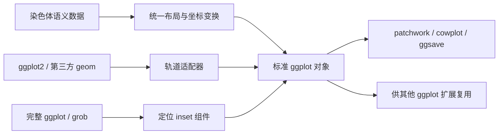

# ggideogram 重构架构契约

> 状态：**生效中的规范性设计（normative）**
> 适用范围：下一代 ggideogram 的全部代码、测试、文档和示例
> 最近更新：2026-08-09
> 当前阶段：M9 已完成，轴文字采用物理净空，染色体内热图按主体轮廓裁切

本文件是本项目重构的单一设计来源。后续开发对话在修改代码前必须完整阅读本文件；
实现与本文件冲突时，以本文件为准。只有用户明确改变设计目标时，才能先修改本文件，
再修改实现。不能为了让现有代码更容易保留而反向弱化本契约。

文中的 **必须（MUST）**、**应当（SHOULD）** 和 **可以（MAY）** 分别表示不可违反的
发布条件、默认应遵循的设计，以及不会破坏架构的可选能力。

---

## 1. 一句话定位

ggideogram 必须成为一个“染色体坐标域上的 Grammar of Graphics 扩展”，而不是一个用
ggplot2 重新绘制 RIdeogram 固定版式的渲染器。除完整 ideogram 布局外，染色体还必须
能作为普通 ggplot 的原生离散 x/y 轴组件，以 `chr` 键与柱状图、箱线图、折线图等直接
对齐。

它应当像 ggtree 对树坐标所做的扩展一样：以专用数据模型和布局变换表达领域结构，
以标准 ggplot2 图层表达视觉标记，并允许领域图层、普通 ggplot2 图层和完整 ggplot
对象在明确的坐标/组件协议下相互组合。

## 2. 最终能力：三向组合与轴级融合

以下三种组合方向同等重要，缺少任何一种都不算完成重构。

### 2.1 ggideogram 作为普通 ggplot 向外组合

`ggideogram()` 的结果必须是标准 ggplot 对象，可以直接：

- 使用 `+ theme()`、`+ labs()`、`+ scale_*()` 和 `+ guides()`；
- 由 patchwork、cowplot、gridExtra 等布局工具拼接；
- 由 `ggsave()`、`ggplotGrob()` 和支持 ggplot 的输出工具处理；
- 作为 patchwork/cowplot 的 inset 或其他组合图的一个面板；
- 收集、保留或关闭原生 ggplot2 图例。

组合工具改变面板尺寸时，染色体和轨道的数据几何应按坐标系统缩放；点、文字、线宽、
图例键等物理组件不得被当作一张整图进行缩放或压扁。

### 2.2 普通 ggplot2 几何对象或完整图形向内接入

ggideogram 必须提供两种不同层级的接入方式，不能混为一谈。

1. **几何图层接入**：将 `geom_point`、`geom_line`、`geom_col`、`geom_area`、
   `geom_boxplot`、`geom_violin`、`geom_tile`、`geom_text` 以及兼容的第三方 geom，
   通过染色体轨道适配器接入染色体坐标。
2. **完整图形接入**：将已经构建好的 ggplot/grob 作为 inset，锚定到某条染色体、
   某个基因组位置、某个区间或显式面板位置。

第一种方式必须保留输入 geom 的标准美学属性和参数；第二种方式必须保留子图自身的
坐标、主题和图例所有权。不能把完整子图拆成未知内部图层后再猜测其语义。

### 2.3 ggideogram 向其他图形体系提供组件

除作为完整 ggplot 面板外，ggideogram 还必须提供稳定的可提取边界：

- 整个 ideogram 可转换为标准 grob；
- 染色体主体、轨道、标记和区间注释本身都是普通 ggplot2 layer；
- 第三方 ggplot2 扩展可以复用公开的数据投影和轨道规范，而不复制内部布局代码；
- 不要求其他包了解 canvas pixel、A4 页面或 RIdeogram 历史参数。

### 2.4 染色体作为普通 ggplot 的 x/y 轴

轴级融合是独立于外部拼接和 inset 的核心能力。普通 ggplot 的数据映射、Stat 和 Geom
必须保持原样，染色体只通过离散 scale/guide 占据轴标签槽：

```r
ggplot(chr_summary, aes(Chr, Count)) +
  geom_col() +
  scale_x_chromosome(human_karyotype)

ggplot(gene_density, aes(Value, Chr)) +
  geom_boxplot() +
  scale_y_chromosome(human_karyotype)
```

该协议必须满足：

- `chr` 通过离散 scale 的 break 对齐，顺序、`drop` 和反向顺序遵循 ggplot2；
- 染色体长度和着丝粒位置来自语义 karyotype，不从面板像素或示例数据猜测；
- 染色体轴可用于 bottom、top、left、right 四个标准位置；
- 染色体主体位于 guide 的标签槽，数值轴和普通 geom 仍归宿主 ggplot 所有；
- 轴主体长度、宽度、标签间距和样式采用有名字、可覆盖的物理单位参数；
- 不得通过 patchwork/cowplot 并排一个 ideogram 面板来声称实现了共享轴；
- 不得通过事后 gtable 手术、整图缩放或裁剪拼接来伪造对齐。



## 3. 从 ggtree 借鉴什么，不照搬什么

本设计借鉴 ggtree 的组件思想，而不是复制其树数据结构或操作符。

必须借鉴的模式：

- 构造函数只是领域图层组合的快捷入口，而不是另一套渲染器；
- 普通 ggplot2 图层可以直接用于已转换的领域坐标；
- 关联数据可以通过明确的键附着到领域对象；
- 一个通用适配器可以接受 `geom`、`data`、`mapping` 和 `...`，将外部数据按领域结构
  对齐后绘制；
- 领域骨架可以进入宿主图的原生 scale/guide，而不要求宿主 geom 改写数据坐标；
- 完整 ggplot 可以作为 inset 组件锚定到领域对象；
- 多个关联面板/轨道可以逐层加入，而不是通过一个互斥枚举选择唯一模式。

不得照搬的部分：

- 不复用 `%<+%` 名称，避免与 ggtree/ggfun 发生操作符冲突；
- 不把树节点/树梢的单轴对齐假设套到染色体。染色体数据有两个关键键：`chr` 和
  `position`，轨道还多一个 `value` 维度；
- 不依赖修改 ggplot 构建结果或事后 gtable 手术来实现核心布局；
- 不通过固定比例的 `offset`/`pwidth` 隐式累加所有轨道；轨道占位必须是可检查的
  声明式布局。

参考实现思想来自 ggtree 的数据附着、`geom_facet()`/`facet_plot()`、`geom_inset()`，
以及 ggtreeExtra 的 `geom_fruit()`；具体实现必须使用 ggplot2 公共扩展接口。

## 4. 现有实现为什么不能继续打补丁

当前代码可以输出 ggplot，但内部仍受原版渲染模型约束：

- `ideogram()` 用 `label_type` 在 marker、line、polygon、point、bar、text 等模式中
  互斥选择，无法自然表达多轨道同时存在；
- 图层主要接收一个预先计算好的 `ideogram_layout`，而不是标准的
  `data`、`mapping`、`stat`、`position` 和 `...`；
- marker 由 `GeomIdeogramMarker`/多边形顶点自绘，不是真正的 `GeomPoint`；
- 染色体、轨道和注释先投影到 canvas pixel，再交给 ggplot2，导致 API 暴露 px/mm
  换算和历史页面概念；
- `compat`、classic legend、A4、`Lx/Ly`、形状注册表和原版 repel 行为形成第二条
  渲染分支，使每次改动都要兼顾两套互相冲突的目标；
- 将布局作为 `attr(p, "ideogram_layout")` 暴露给用户，不是稳定的 ggplot2 扩展协议。

因此本次工作是破坏性重构。不能以“保持旧测试全部不变”为目标；旧输出只用于验证
生物学位置和视觉含义，不再用于逐像素复刻。

## 5. 第一性原理与不变量

### 5.1 科学坐标不变量

- `chr`、`start`、`end`、`position` 必须始终代表输入基因组坐标，不能被视觉避让
  直接改写。
- 一个绘图对象内默认使用统一的 bp 比例，使不同染色体长度可以直接比较。
- 如果未来提供 `scale_length = "per_chr"`，必须是显式选择，并通过轴或文档明确说明
  染色体间长度不再可比。
- 数据过滤、窗口汇总、归一化、截断和数值尺度必须发生在可追踪的数据/Stat 阶段，
  不能隐藏在 Geom 的 `draw_panel()` 中。
- 超出染色体范围的数据默认报错或给出明确策略；不得静默移动到边界。

### 5.2 图形语法不变量

- marker 的绘制 Geom 必须是 `ggplot2::GeomPoint`；连接线使用 `GeomSegment`。
- 文字使用标准文字 Geom；线宽、点大小、文字大小采用 ggplot2 的物理尺寸语义。
- 染色体轮廓、着丝粒和 band 可以使用领域专用 Geom/Stat，因为它们是 ggplot2
  不具备的领域几何。
- 所有公开图层必须采用 ggplot2 风格签名：`mapping = NULL, data = NULL, stat, position,
  ..., inherit.aes, show.legend, na.rm`，只在确有领域语义时增加参数。
- 美学映射必须由 `aes()` 和标准 scale 控制；不能把颜色映射藏在预计算的十六进制列中。
- 图例必须由 ggplot2 guide 生成；不得重新实现 classic legend。

### 5.3 尺寸不变量

- 染色体长度、染色体宽度、轨道宽度、柱长和曲线位置属于数据/布局几何，可以随
  面板缩放。
- 点、文字、线宽、stroke 和图例键属于物理组件，按 ggplot2 方式保持可读尺寸。
- 禁止将已完成的 ideogram 转成单张 raster/grob 后整体缩放来模拟响应式布局。
- 染色体轮廓不得因为 x/y 独立缩放而变形；布局必须通过行列数、面板范围和固定
  坐标比例解决可用空间，而不是压扁主体。
- substantial whitespace 必须来自可解释的固定比例余量、标签空间、轨道空间或
  inset 空间；不得保留匿名 A4 空白区。

### 5.4 实现不变量

- 核心实现只能依赖 ggplot2 的公开扩展接口（Geom、Stat、Coord、Facet、Position、
  `layer()`、`ggplot_add()` 等）。
- 不得依赖 ggplot 对象未公开字段、固定 gtable 子节点名称或某个设备的像素密度。
- 目标兼容 ggplot2 3.5+ 的公共接口；当前参考运行时为 ggplot2 4.0.3。若某项能力
  必须提高最低版本，必须先在本文件记录原因并修改 DESCRIPTION。
- 核心坐标只保存语义数据和无量纲布局值；输出设备尺寸只能出现在保存函数、示例或
  测试中。

## 6. 分层架构

### 6.1 语义数据层

建议的领域对象为 `ideogram_data`。它只表达数据，不保存屏幕坐标。

```r
x <- as_ideogram_data(
  karyotype,
  mapping = aes(chr = Chr, start = Start, end = End),
  centromere = aes(start = CE_start, end = CE_end),
  cytoband = cytoband
)
```

内部规范字段：

| 数据类型 | 必需语义 | 可选语义 |
| --- | --- | --- |
| karyotype | `chr`, `start`, `end` | `centromere_start`, `centromere_end` |
| point | `chr`, `position` | `id`, `group` |
| interval | `chr`, `start`, `end` | `id`, `group`, `value` |
| track observation | `chr`, `position`, `value` | `group`, `series` |
| chromosome metadata | `chr` | 任意可映射字段 |
| inset | `chr` 和/或 `position` | `plot`, `width`, `height` |

用户不必重命名原始列；`aes()` 或显式 `by` 负责映射。内部字段统一使用带前缀的名称，
避免覆盖用户列。

数据连接必须显式声明键：

```r
p + chr_data(metadata, by = c(chr = "Chr"))
p + locus_data(annotations, by = c(chr = "Chr", position = "Pos"))
```

连接时必须检查重复键、未知染色体和多对多关系。允许多对多时必须由用户显式选择，
不能静默扩增数据。

### 6.2 布局层

`ideogram_layout()` 只负责将语义对象变为可绘制布局：

- 染色体顺序、分行和每行数量；
- 全局 bp 到纵向位置的变换；
- 染色体主体的局部横向范围；
- 左右轨道的顺序、宽度和间距；
- 行间距、染色体间距和标签占位；
- 内容边界和固定比例所需的面板范围。

布局使用无量纲单位。允许的几何基准只有：

1. 染色体主体标准宽度定义为 `1`；这是坐标归一化定义，不是显示像素。
2. 圆帽半径为主体宽度的一半；这是胶囊几何成立的条件。
3. 基因组位置按 bp 比例映射到主体长轴；这是科学坐标条件。

其余参数必须集中在 `ideogram_layout()`、`track()` 或 `theme_ideogram()` 的公开参数中，
不能散落为匿名常数。

### 6.3 声明式轨道布局

轨道必须在布局中具有稳定身份，不能仅靠“第几个被添加的 layer”猜测位置。

```r
tracks <- track_layout(
  markers = track(side = "right", width = 0.5, gap = 0.15),
  density = track(side = "right", width = 1.2, gap = 0.20,
                  value_scale = "global"),
  counts  = track(side = "left", width = 1.0, gap = 0.20,
                  value_scale = "per_track")
)
```

轨道规范至少包含：

- 唯一 `id`；
- `side = "left" | "right" | "overlay"`；
- 相对于主体宽度的 `width` 和 `gap`；
- `value_scale = "global" | "per_track" | "per_chr"`；
- 可选 `limits`、`transform`、`reverse` 和轴规范；
- 是否允许多层共享同一轨道。

同一 `id` 的多个 layer 必须共享空间和数值尺度；不同 `id` 自动按声明顺序排布。
任何自动宽度都必须由内容/规范可重复推导，并可被显式参数覆盖。

### 6.4 坐标与 Stat 层

领域美学与标准 x/y 之间必须有单一变换入口：

- 主体图层输入 `chr/start/end`；
- marker 输入 `chr/position`；
- 数值轨道输入 `chr/position/value` 或 `chr/start/end/value`；
- Stat 负责验证、分组、排序、聚合和产生标准绘图坐标；
- Coord 负责将染色体局部坐标放入全局布局，并维护固定几何比例。

不得在每个 Geom 中各写一套 `bp2y()` 或轨道偏移算法。公共低级投影函数必须可供
第三方扩展复用，例如：

```r
project_chr_point(layout, data, chr, position)
project_chr_interval(layout, data, chr, start, end)
project_chr_track(layout, data, chr, position, value, track)
```

这些函数返回标准数值坐标和稳定的分组字段，不返回 grob。

### 6.5 Geom 层

领域专用 Geom 只实现 ggplot2 没有的标记：

- `GeomChromosome`：胶囊、着丝粒和方向；
- `GeomCytoband`：受染色体轮廓裁切的区间；
- 必要时的 chromosome-aware axis/label Geom。
- overlay tile 的染色体轮廓遮罩；它必须继承并委托 `GeomTile` 绘制，不能重新实现
  tile 的 fill/colour/scale/guide 语义。

以下内容不得自绘：

- marker 点；
- marker 连接线；
- 普通折线、柱、面积、箱线、小提琴、tile、文字；
- 普通图例键。

这些必须复用 ggplot2 或第三方包提供的 Geom。

## 7. 公共 API 契约

以下名称是目标 API。实现阶段可以修正命名细节，但改变职责边界必须先更新本文件。

### 7.1 主构造函数

```r
p <- ggideogram(
  data,
  mapping = aes(chr = Chr, start = Start, end = End),
  centromere = aes(start = CE_start, end = CE_end),
  tracks = NULL,
  ncol = NULL,
  orientation = "vertical",
  ...
)
```

职责：创建语义数据、布局、基础坐标和主题，并加入默认染色体主体层。

非职责：保存文件、添加固定图例、猜测所有轨道、读取 label type、模拟原版 SVG 页面。

`ideogram()` 可以保留为轻量快捷入口，但其实现必须等价于公开组件的组合；不能拥有
独立分支或私有渲染行为。

### 7.2 染色体原生图层

目标图层包括：

```r
geom_chromosome()
geom_cytoband()
geom_chr_name()
geom_chr_axis()
geom_chr_interval()
geom_chr_text()
geom_chr_marker()
geom_chr_link()
```

示例：

```r
p +
  geom_chr_marker(
    data = markers,
    aes(chr = Chr, position = Pos,
        shape = Type, colour = Type, fill = Type, size = Score),
    track = "markers",
    stroke = 0.25
  ) +
  scale_shape_manual(values = c(circle = 21, box = 22, triangle = 24)) +
  scale_size_continuous(range = c(1, 4))
```

验收要求：`geom_chr_marker()` 构造的 layer 的 Geom 必须继承 `GeomPoint`；用户设置或
映射 `size` 时不得经过 canvas pixel 换算。

避让属于位置调整，不属于点的绘制。应提供 chromosome-aware `position_chr_repel()`；
它可以调整显示位置，但必须保留真实基因组锚点，并由 `geom_chr_link()` 显式显示连接。

### 7.3 通用轨道适配器

```r
geom_chr_track(
  mapping,
  data,
  geom,
  track,
  stat = "identity",
  position = "identity",
  inherit.aes = FALSE,
  show.legend = NA,
  ...
)
```

使用方式应接近 ggtree 的 `geom_facet()`/ggtreeExtra 的 `geom_fruit()`：

```r
p +
  geom_chr_track(
    data = signal,
    geom = ggplot2::geom_line,
    track = "density",
    mapping = aes(chr = Chr, position = Mid, value = Density,
                  group = Sample, colour = Sample),
    linewidth = 0.4
  ) +
  geom_chr_track(
    data = counts,
    geom = ggplot2::geom_col,
    track = "counts",
    mapping = aes(chr = Chr, position = Mid, value = Count, fill = Class),
    width = 0.8
  )
```

所有沿整条染色体展开的附图必须优先使用轨道协议，而不是包装成漂浮 inset。轨道的
`position` 轴与染色体长轴使用同一 bp 投影：竖排时为纵向，横排时为横向；`value`
只占用轨道的横向宽度。需要显示刻度时，染色体 bp 轴由 `ggideogram(axis = ...)`
提供，轨道数值轴由 `geom_track_axis()` 提供，两者职责不得混淆。完整 ggplot inset
只用于位点/区间对应的独立子图；除非用户显式声明内部轴语义，核心包不得猜测并改写
子图坐标来伪造轴对齐。

常用薄封装应当提供更清楚的帮助页：

```r
geom_track_point()
geom_track_line()
geom_track_col()
geom_track_area()
geom_track_ribbon()
geom_track_boxplot()
geom_track_violin()
geom_track_tile()
geom_track_text()
```

薄封装只能设置合适的默认 geom/stat，不能复制坐标投影代码。

`geom_track_tile(clip = "auto")` 是薄封装的一个受限几何增强：当且仅当目标为
`side = "overlay"` 的染色体内轨道时，默认把 `GeomTile` 的输出遮罩到统一染色体
轮廓（包括圆帽和着丝粒）；外侧轨道保持原生矩形 tile。遮罩的 `curve_points` 必须
来自 `ideogram_layout()` 的公开几何参数，不能通过缩短首尾数据、为特定 bin 留白或
写死像素偏移来伪造圆帽。用户可用 `clip = "off"` 显式保留未裁切 tile。

染色体 bp 轴和轨道数值轴的标签必须共用一个物理净空规则：标签近边缘位于
`tick_length + label_gap * text_size` 之外，其中 `tick_length` 与字号使用 ggplot2/grid
物理单位，`label_gap` 使用 em。不得只从轴线按 `hjust`/`vjust` 偏移，因为这样会让
刻度线随长度变化后伸进数字。

轨道适配器的最小兼容协议是：输入 geom 能消费标准 x/y 及其自身所需美学。对于没有
薄封装的 geom，用户应能通过 `geom_chr_track(geom = ...)` 或先调用
`project_chr_track()` 后使用原生 layer。

### 7.4 完整 ggplot/grob inset

```r
geom_chr_inset(
  data,
  mapping = aes(chr = Chr, position = Pos, plot = Plot),
  width,
  height,
  hjust = NULL,
  vjust = NULL,
  clip = "on",
  overlap = "error"
)
```

`plot` 可以是 ggplot 或 grob 的 list-column。`width`/`height` 必须使用明确的物理单位
或规范化面板单位，默认含义必须写入帮助页。inset 不参与宿主 plot 的数据 scale；
其内部 guide 默认归 inset 自己所有，除非用户显式关闭。

`placement = "beside"` 的安全默认值不是以锚点为中心铺开：锚点必须位于 inset 的内侧
边界，子图只向染色体外侧展开；只有 `placement = "center"` 默认使用
`hjust = vjust = 0.5`。指定 inset 轨道时，锚点位于该轨道的内边界，轨道宽度负责声明
可用空间。对能在构建阶段换算为面板比例的多个 inset，默认必须检测 inset--inset 和
inset--染色体碰撞并报错，不得依靠图层顺序把遮挡静默画出来；用户只能通过扩大轨道、
缩小组件或显式 `overlap = "allow"` 接受遮挡。

还应支持区间锚定：

```r
geom_chr_inset(
  data = locus_plots,
  aes(chr = Chr, start = Start, end = End, plot = Plot),
  placement = "beside"
)
```

### 7.5 反向嵌入和外部拼接

不发明另一套组合运算符。标准用法必须直接成立：

```r
p_ideo | p_bar
(p_ideo | p_bar) / p_box
patchwork::inset_element(p_ideo, left = 0.60, bottom = 0.55,
                         right = 0.98, top = 0.98)
cowplot::ggdraw(p_main) + cowplot::draw_plot(p_ideo, ...)
grid::grobTree(ggplot2::ggplotGrob(p_ideo))
```

如提供 `as_ideogram_grob()`，它只能是 `ggplotGrob()` 的稳定便捷封装，不能产生与
标准 ggplot 输出不同的第二种版式。

### 7.6 原生染色体轴

公开入口为：

```r
scale_x_chromosome(
  data,
  mapping = aes(chr = Chr, start = Start, end = End),
  centromere = aes(start = CE_start, end = CE_end),
  ...
)

scale_y_chromosome(...)
guide_chromosome_axis(...)
```

`scale_x_chromosome()`/`scale_y_chromosome()` 是标准离散 scale 的领域薄封装；它们必须
接受普通离散 scale 的 `name`、`breaks`、`labels`、`limits`、`drop`、`position` 和
`expand` 语义。`guide_chromosome_axis()` 必须通过 ggplot2 公开 Guide 扩展接口实现，
不得读取或修改已构建 gtable 的内部节点。

guide 必须以原始 break 值而不是格式化后的显示标签连接 karyotype。显示标签可以改变，
但不能改变染色体匹配。缺失于 karyotype 的可见 break 必须给出明确错误；未出现在宿主
数据中的染色体是否保留由 scale 的 `limits`/`drop` 决定。

染色体 guide 是轴结构，不是数据值：主体最大长度、横向宽度、文字和线宽使用 grid/
ggplot2 物理单位，在设备尺寸变化时保持可读；各染色体之间的相对长度和着丝粒位置由
karyotype 数据推导。普通数据面板不因 guide 大小改变比例或被整体缩放。

## 8. 美学、Scale 和 Guide 契约

- marker 的 `shape`、`size`、`colour`、`fill`、`alpha`、`stroke` 使用标准 ggplot2
  scale 和 guide。
- 轨道图层的颜色/填充遵循普通 ggplot2 规则；相同语义映射可以共享 guide。
- 单一 plot 中同一 aesthetic 默认只有一个 scale。需要多个独立 colour/fill scale 时，
  可以与 `ggnewscale` 互操作，但核心包不重新实现多 scale 引擎。
- guide 归产生它的映射所有。只有多个组件使用完全相同的语义映射时才应收集共享图例。
- 轨道数值轴由轨道规范拥有，不得伪装成宿主 plot 的主 x/y 轴。
- `theme_ideogram()` 只提供适合 ideogram 的主题默认值；用户的后加 `theme()` 必须覆盖它。
- 颜色默认值按语义角色组织，不把 RGB 值写入坐标或布局代码。

## 9. 无写死参数政策

“不写死”不等于没有默认值，而是每个默认值必须满足以下至少一项：

1. 是几何/科学定义成立的前提；
2. 是集中、命名、记录并可被用户覆盖的公共默认值；
3. 由输入数据或已声明组件可重复推导。

允许的固定前提：

- 染色体标准宽度的内部归一化值；
- 胶囊圆帽与主体宽度的几何关系；
- bp 沿染色体长轴的线性映射；
- ggplot2 对 point/text/linewidth 的物理单位语义。

禁止的隐藏常数：

- A4 宽高和 90 DPI；
- canvas pixel 到毫米的历史换算；
- 绝对图例坐标；
- 为某一份示例数据写死的染色体数、行列数或画布大小；
- 分散在多个 Geom 中的轨道 offset、lane pitch 和 marker size；
- 为填满空白而改变字体、点、线宽或边距的补偿系数。

所有视觉默认集中到以下三个入口：

- `ideogram_layout()`：数据几何和行列布局；
- `track()`/`track_layout()`：轨道几何；
- `theme_ideogram()` 与标准 `scale_*()`：物理组件和视觉样式。

## 10. 响应式缩放与空白处理

ggideogram 的“缩放”必须与 ggplot2 一致，而不是缩放一张已完成图片。

| 对象 | 缩放行为 |
| --- | --- |
| 染色体长度、主体宽度、轨道跨度 | 随数据面板缩放，保持坐标关系 |
| marker 点 | 物理大小由 `size`/scale 决定，不被面板压扁 |
| 字体 | 物理字号保持不变 |
| 线宽和 stroke | 物理线宽保持不变 |
| inset 完整子图 | 在分配的 viewport 内重新构建，不先 rasterize |
| 图例 | 由 guide/theme 重新布局，不作为图像缩放 |

固定比例造成的多余空间必须优先通过以下顺序解决：

1. 根据染色体数量和目标组合槽调整 `ncol`/行数；
2. 根据真实内容重新计算 tight data extent；
3. 调整轨道宽度、轨道分组和局部 guide 所有权；
4. 为固定比例保留有明确用途的余量。

禁止以 `aspect = "fill"` 压扁染色体作为默认方案，也禁止通过放大文字或点填空。

## 11. 推荐的内部文件边界

重构后建议按职责组织，而不是按原版功能分支组织：

```text
R/
  data-model.R          # ideogram_data、验证和显式连接
  layout-core.R         # 染色体与行列布局
  track-spec.R          # track/track_layout
  coord-ideogram.R      # 全局/局部坐标变换
  stat-chromosome.R     # 领域数据到标准坐标
  stat-track.R          # 轨道数据投影
  geom-chromosome.R     # 领域专用主体几何
  geom-cytoband.R       # band 裁切
  geom-marker.R         # GeomPoint/GeomSegment 的薄封装
  geom-track.R          # 任意 geom 适配器与常用薄封装
  component-inset.R     # ggplot/grob inset
  component-data.R      # chr_data/locus_data 与 ggplot_add
  theme-ideogram.R      # 主题与公开视觉默认
  ggideogram.R          # 主构造函数和轻量 preset
```

文件名可以调整，但这些职责不能再次合并成一个按 `label_type` 分支的巨型函数。

## 12. 迁移顺序

当前实施状态：

| 里程碑 | 状态 | 已验证范围 |
| --- | --- | --- |
| M0 | 完成 | 重构前 729 项测试与 `R CMD check` 基线 |
| M1 | 完成 | `ideogram_data`、无像素布局、点/区间投影、逆投影、横纵方向和边界检查 |
| M2 | 完成 | 无像素染色体主体、cytoband、标准文字名称、物理尺寸刻度和固定坐标比例 |
| M3 | 完成 | 新引擎 marker 为真实 `GeomPoint`、link 为 `GeomSegment`，标准 scale/guide 与保留锚点的染色体内避让 |
| M4 | 完成 | 命名轨道布局、共享/分染色体数值尺度、通用 geom 适配、9 个薄封装、原生 marker 轨道和局部轴 |
| M5 | 完成 | 显式键数据附着、完整 ggplot/grob inset、向外安全定位、规范化视口碰撞检查与标准 grob 边界 |
| M6 | 完成 | 正式 `ggideogram()`、薄 `ideogram()`、patchwork/cowplot/ggsave 边界及原版数据的 bp 对齐轨道 + 柱状图 + 箱线图示例 |
| M7 | 完成 | 删除旧引擎、更新发布文档与迁移说明；四张原版数据画廊覆盖三向组合；源码包 `R CMD check --no-manual` 为 `Status: OK` |
| M8 | 完成 | 原生 x/y 染色体 guide、普通 Geom 零转写、原版数据双向轴示例；源码包 `R CMD check --no-manual` 为 `Status: OK` |
| M9 | 完成 | bp/轨道轴共享物理净空标签；overlay tile 按统一圆帽/着丝粒轮廓裁切；原版数据图已重生成；源码包 `R CMD check --no-manual` 为 `Status: OK` |

### M0：冻结可运行基线

- 保留当前测试结果作为重构前基线；当前为 729 项测试通过，`R CMD check` 为 OK。
- 仅保存原版数据、关键生物学位置和代表性视觉效果；不再扩大逐像素兼容测试。
- 为新 API 建立独立测试文件，避免新旧行为混在同一断言中。

### M1：语义数据和无像素布局

- 实现 `ideogram_data` 和统一字段映射；
- 重写 `ideogram_layout()`，去除 canvas px/A4 依赖；
- 建立公开投影函数及 round-trip/边界测试；
- 暂不实现所有视觉图层。

### M2：染色体主体、band、名称和轴

- 用新 Stat/Coord 绘制主体；
- 验证不同设备尺寸下染色体不变形；
- 名称、轴和线宽使用标准物理尺寸；
- tight extent 只由真实内容推导。

### M3：原生 marker

- 新引擎不得调用 `GeomIdeogramMarker` 和 canvas polygon marker；迁移期间二者
  仅为旧 `ideogram()` 入口保留，并在 M7 随旧引擎一并删除；
- `geom_chr_marker()` 使用 `GeomPoint`；
- `geom_chr_link()` 使用 `GeomSegment`；
- 支持标准 shape/size/fill/colour/alpha/stroke scale；
- 实现可选 chromosome-aware position adjustment。

### M4：声明式多轨道

- 实现 `track()`/`track_layout()`；
- 实现 `geom_chr_track(geom = ...)`；
- 实现 point、line、col、area、ribbon、boxplot、violin、tile、text 薄封装；
- 支持多个轨道、同轨多层、左右侧和显式数值尺度；
- 轨道轴、图例和空间归属可检查。

### M5：完整组件接入

- 实现 `chr_data()`/`locus_data()`；
- 实现 ggplot/grob list-column inset；
- 验证 inset 与宿主坐标、裁切和图例互不污染；
- 发布第三方扩展所需的最小投影接口。

### M6：主入口和外部组合

- `ggideogram()` 成为正式主入口；
- `ideogram()` 降为公开图层组合的薄 preset；
- 验证 patchwork、cowplot、`ggplotGrob()`、`ggsave()`；
- 使用原版数据制作 ideogram + 柱状图 + 箱线图组合示例。

### M7：删除旧引擎并完成文档

- 删除 `compat`、classic legend、A4 canvas、`Lx/Ly`、`marker_size_mode`；
- 删除 shape registry、自绘 marker、原版 repel 和 `label_type` 核心分支；
- 删除不再使用的 px/mm 常量和逐像素测试；
- 更新 README、帮助页、迁移指南和 vignette；
- 提升包版本并执行最终 `R CMD check`。

### M8：染色体轴原生融合

- 实现 `guide_chromosome_axis()`，使用 ggplot2 公开 Guide 扩展接口绘制轴内染色体；
- 实现 `scale_x_chromosome()` 和 `scale_y_chromosome()`，按原始 break 与 karyotype
  显式对齐；
- 支持 bottom/top/left/right，染色体长度与着丝粒位置由数据推导；
- 验证原生 `geom_col()`、`geom_line()`、`geom_boxplot()` 无需轨道适配器即可工作；
- 用包内原版数据生成 x 轴柱状图和 y 轴箱线图，证明不是 panel 拼接；
- 更新 README、帮助页、测试并执行 `R CMD check`。

### M9：轴标签净空与染色体内热图裁切

- 用一个 chromosome-aware text Geom 统一 bp 轴和轨道值轴标签位置；
- 标签偏移由刻度物理长度、文字物理字号和公开 em 净空共同推导；
- overlay `geom_track_tile()` 继续继承标准 `GeomTile`，仅增加染色体轮廓遮罩；
- 横/纵方向、轴两侧、轨道首尾端和不同尺寸下均不得以缩字或整图缩放规避碰撞；
- 使用包内原版数据重生成折线、柱、热图、marker 的 bp 对齐轨道图并目视验收；
- 更新 README、帮助页、测试并执行 `R CMD check`。

每个里程碑必须先完成自己的测试门槛，再进入下一阶段。禁止同时重写全部文件后再一次性
排错。

## 13. 测试与验收矩阵

### 13.1 数据和坐标测试

- 染色体顺序、bp 位置、区间端点和着丝粒位置正确；
- 未知染色体、越界位置、重复连接键和不合法区间给出明确错误；
- 多行布局仍使用统一 bp 比例；
- 每条轨道的 value scale、limits 和 transform 可追踪；
- 投影函数在边界值和反向 orientation 下行为确定。

### 13.2 ggplot2 语法测试

- `ggideogram()` 结果可由 `ggplot_build()` 和 `ggplotGrob()` 处理；
- 后加 `theme()`、`labs()`、`scale_*()`、`guides()` 正常覆盖；
- marker layer 的 Geom 继承 `GeomPoint`；
- `scale_size_continuous()`、`scale_shape_manual()` 和标准 guide 生效；
- 普通 geom 参数通过轨道适配器传递，未知参数按 ggplot2 习惯报错；
- 第三方 geom 的最小兼容示例通过。
- `scale_x_chromosome()`/`scale_y_chromosome()` 保持宿主 layer 的 Geom 和数据不变；
- 染色体 guide 按原始 break 而不是格式化标签匹配，四个标准轴位置均可构建；
- 未知染色体 break 明确报错，`limits`/`drop`/顺序遵循离散 scale。

### 13.3 组件测试

- 同一 ideogram 同时包含 marker、line、col、area、tile 和 text 轨道；
- 多层可共享同一轨道，不同轨道不重叠；
- 完整 ggplot inset 可锚定到染色体位置和区间；
- ideogram 可作为 patchwork/cowplot 面板和 inset；
- guide collection 只收集语义相同的 guide；
- `ggplotGrob()` 输出不包含固定 A4 空白轨道。

### 13.4 尺寸回归测试

至少在两个明显不同的输出尺寸和两个不同的组合槽比例下验证：

- marker 的物理直径保持一致；
- 字体和线宽保持一致；
- 染色体轮廓不被压扁；
- 数据曲线、柱长和区间随面板合理缩放；
- 名称与染色体之间的可见间距不消失；
- 图例标题、键和标签不碰撞；
- 没有无法解释的大面积空白。

### 13.5 科研示例测试

使用包内原版数据生成并人工查看：

1. 单独的 human ideogram；
2. marker 使用标准 shape 和连续 size；
3. 基因密度折线轨道；
4. 区间柱状/面积/热图轨道；
5. ideogram 与普通柱状图、箱线图的组合；
6. 一个普通 ggplot 作为 locus inset；
7. ideogram 作为另一个 ggplot/组合图的 inset。
8. 普通柱状图使用染色体 x 轴；
9. 普通箱线图使用染色体 y 轴。

示例只验证真实能力，不允许为了让示例好看而在引擎中加入数据集专用参数。

## 14. 发布完成定义

只有同时满足以下条件，重构才算完成：

- 三向组合全部有可运行示例和自动测试；
- marker 完全由 `GeomPoint` 绘制；
- 同一图中可以并存多个不同轨道；
- 至少一个第三方/普通 ggplot2 geom 通过通用轨道适配器接入；
- 至少一个完整 ggplot 作为 inset 接入 ideogram；
- ideogram 可被 patchwork/cowplot 拼接和嵌入；
- 染色体可作为普通 ggplot 的 x/y 轴，宿主原生 geom 无需转写；
- 主题、scale 和 guide 遵循 ggplot2 标准行为；
- 核心代码不再依赖 A4、DPI、canvas pixel、classic legend 或自绘 marker；
- 原版数据的生物学坐标和含义保持正确；
- 不同输出尺寸下字体、点、线宽不变形，染色体几何不被拉伸；
- 文档、迁移指南、示例和 `R CMD check` 完成。

## 15. 明确的非目标

- 不追求 RIdeogram 逐像素兼容；
- 不保留原版 SVG 字符串拼装模式；
- 不在核心包中重写 patchwork/cowplot；
- 不保证任意未知 geom 无需声明语义即可自动理解 `chr/position/value`；
- 不从完整 ggplot 的内部结构猜测其生物学对齐键；
- 不用缩小字体、点和线宽来弥补不合理布局；
- 不在没有用户数据和统计依据时生成或推断生物学结论。

## 16. 架构决策记录

### ADR-001：ggplot2-first，而不是 output-first

所有能力以标准 ggplot 构建过程为中心，保存文件只是末端行为。

### ADR-002：marker 必须是真正的 GeomPoint

原版三种形状映射到 ggplot2 点形状；自定义形状由 ggplot2/第三方 point geom 扩展，
核心包不维护顶点注册表。

### ADR-003：轨道先声明、图层后使用

轨道的顺序和空间由 `track_layout()` 声明，避免根据 layer 添加顺序进行隐式、不可检查
的布局推断。

### ADR-004：完整 plot 与普通 geom 使用不同组件协议

普通 geom 经坐标适配后参与宿主 scale；完整 plot 作为 inset 保持自己的 scale/theme。

### ADR-005：只保留一个布局真源

所有染色体主体、标记、轨道、名称和轴共享同一个语义布局；不通过 plot attribute 暴露
另一份可漂移的布局副本。

### ADR-006：不保留历史兼容渲染器

`compat` 及其 A4、classic legend、canvas marker 和原版 repel 分支在新架构完成后删除。

### ADR-007：染色体轴使用 Guide，而不是伪装的相邻 panel

`chr` 级融合通过离散 scale 和公开 Guide 扩展完成。染色体是轴标签槽中的结构化 guide，
普通图层继续使用宿主 x/y 坐标；外部拼接仅用于完整图形组合，不能替代轴语义。

## 17. 后续开发对话执行协议

任何后续对话在修改代码前必须：

1. 完整阅读本文件；
2. 说明当前处理的里程碑（M1–M9）和涉及的契约章节；
3. 检查当前代码和相关测试，不根据旧对话猜测状态；
4. 只实现该里程碑范围内最小完整的垂直切片；
5. 用最接近改动的测试验证，再按公共接口风险决定是否运行完整检查；
6. 如果实现需要偏离本文件，先停止编码，向用户说明冲突并取得明确同意；
7. 经同意后先更新本文件的 ADR/契约，再改代码；
8. 完成后报告哪些验收项已通过、哪些尚未进入实施。

禁止未来对话为了快速修一个视觉问题而重新引入下列模式：

- canvas pixel 尺寸；
- 整图 raster/grob 缩放；
- `label_type` 互斥总开关；
- 自绘 marker；
- 绝对定位 classic legend；
- 示例数据专用硬编码；
- 绕过公开 ggplot2 扩展接口的 gtable 节点修改。

## 18. 参考资料

- [ggtree：使用图形语法注释树](https://yulab-smu.top/treedata-book-2ed/06_ggtree_annotation.html)
- [ggtree：关联数据、geom_facet 与 facet_plot](https://yulab-smu.top/treedata-book-2ed/08_ggtree_tree_with_data.html)
- [ggtree：geom_inset 接入完整子图](https://yulab-smu.top/treedata-book/chapter8.html)
- [Bioconductor ggtreeExtra：geom_fruit 接入任意 geom](https://bioconductor.org/packages/release/bioc/manuals/ggtreeExtra/man/ggtreeExtra.pdf)
- [ggplot2 官方扩展指南](https://ggplot2.tidyverse.org/articles/extending-ggplot2.html)
