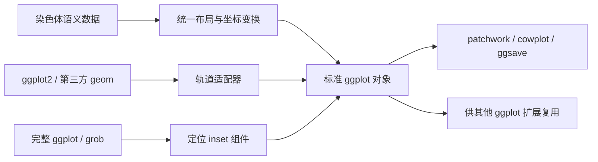

# ggideogram 重构架构契约

> 状态：**生效中的规范性设计（normative）**
> 适用范围：下一代 ggideogram 的全部代码、测试、文档和示例
> 最近更新：2026-10-03
> 当前阶段：M10–M20 已实现；0.5.0 统计轨道、窗口边界和环形标题修正后完整测试通过，包检查为 Status: OK

本文件是本项目重构的单一设计来源。后续开发对话在修改代码前必须完整阅读本文件；
实现与本文件冲突时，以本文件为准。只有用户明确改变设计目标时，才能先修改本文件，
再修改实现。不能为了让现有代码更容易保留而反向弱化本契约。

文中的 **必须（MUST）**、**应当（SHOULD）** 和 **可以（MAY）** 分别表示不可违反的
发布条件、默认应遵循的设计，以及不会破坏架构的可选能力。

---

## 1. 一句话定位

ggideogram 必须成为一个“染色体坐标域上的 Grammar of Graphics 扩展”，而不是一个用
ggplot2 重新绘制 RIdeogram 固定版式的渲染器。除完整 ideogram 布局外，染色体还必须
能作为普通 ggplot 的原生离散 x/y 轴组件，以 `chr` 键与柱状图、箱线图、折线图等直接
对齐。

它应当像 ggtree 对树坐标所做的扩展一样：以专用数据模型和布局变换表达领域结构，
以标准 ggplot2 图层表达视觉标记，并允许领域图层、普通 ggplot2 图层和完整 ggplot
对象在明确的坐标/组件协议下相互组合。

## 2. 最终能力：三向组合与轴级融合

以下三种组合方向同等重要，缺少任何一种都不算完成重构。

### 2.1 ggideogram 作为普通 ggplot 向外组合

`ggideogram()` 的结果必须是标准 ggplot 对象，可以直接：

- 使用 `+ theme()`、`+ labs()`、`+ scale_*()` 和 `+ guides()`；
- 由 patchwork、cowplot、gridExtra 等布局工具拼接；
- 由 `ggsave()`、`ggplotGrob()` 和支持 ggplot 的输出工具处理；
- 作为 patchwork/cowplot 的 inset 或其他组合图的一个面板；
- 收集、保留或关闭原生 ggplot2 图例。

组合工具改变面板尺寸时，染色体和轨道的数据几何应按坐标系统缩放；点、文字、线宽、
图例键等物理组件不得被当作一张整图进行缩放或压扁。

### 2.2 普通 ggplot2 几何对象或完整图形向内接入

ggideogram 必须提供两种不同层级的接入方式，不能混为一谈。

1. **几何图层接入**：将 `geom_point`、`geom_line`、`geom_col`、`geom_area`、
   `geom_boxplot`、`geom_violin`、`geom_tile`、`geom_text` 以及兼容的第三方 geom，
   通过染色体轨道适配器接入染色体坐标。
2. **完整图形接入**：将已经构建好的 ggplot/grob 作为 inset，锚定到某条染色体、
   某个基因组位置、某个区间或显式面板位置。

第一种方式必须保留输入 geom 的标准美学属性和参数；第二种方式必须保留子图自身的
坐标、主题和图例所有权。不能把完整子图拆成未知内部图层后再猜测其语义。

### 2.3 ggideogram 向其他图形体系提供组件

除作为完整 ggplot 面板外，ggideogram 还必须提供稳定的可提取边界：

- 整个 ideogram 可转换为标准 grob；
- 染色体主体、轨道、标记和区间注释本身都是普通 ggplot2 layer；
- 第三方 ggplot2 扩展可以复用公开的数据投影和轨道规范，而不复制内部布局代码；
- 不要求其他包了解 canvas pixel、A4 页面或 RIdeogram 历史参数。

### 2.4 染色体作为普通 ggplot 的 x/y 轴

轴级融合是独立于外部拼接和 inset 的核心能力。普通 ggplot 的数据映射、Stat 和 Geom
必须保持原样，染色体只通过离散 scale/guide 占据轴标签槽：

```r
ggplot(chr_summary, aes(Chr, Count)) +
  geom_col() +
  scale_x_chromosome(human_karyotype)

ggplot(gene_density, aes(Value, Chr)) +
  geom_boxplot() +
  scale_y_chromosome(human_karyotype)
```

该协议必须满足：

- `chr` 通过离散 scale 的 break 对齐，顺序、`drop` 和反向顺序遵循 ggplot2；
- 染色体长度和着丝粒位置来自语义 karyotype，不从面板像素或示例数据猜测；
- 染色体轴可用于 bottom、top、left、right 四个标准位置；
- 染色体主体位于 guide 的标签槽，数值轴和普通 geom 仍归宿主 ggplot 所有；
- 轴主体长度、宽度、标签间距和样式采用有名字、可覆盖的物理单位参数；
- 不得通过 patchwork/cowplot 并排一个 ideogram 面板来声称实现了共享轴；
- 不得通过事后 gtable 手术、整图缩放或裁剪拼接来伪造对齐。


```mermaid
flowchart LR
    D["染色体语义数据"] --> L["统一布局与坐标变换"]
    L --> P["标准 ggplot 对象"]
    G["ggplot2 / 第三方 geom"] --> A["轨道适配器"]
    A --> P
    Q["完整 ggplot / grob"] --> I["定位 inset 组件"]
    I --> P
    P --> C["patchwork / cowplot / ggsave"]
    P --> E["供其他 ggplot 扩展复用"]
```

## 3. 从 ggtree 借鉴什么，不照搬什么

本设计借鉴 ggtree 的组件思想，而不是复制其树数据结构或操作符。

必须借鉴的模式：

- 构造函数只是领域图层组合的快捷入口，而不是另一套渲染器；
- 普通 ggplot2 图层可以直接用于已转换的领域坐标；
- 关联数据可以通过明确的键附着到领域对象；
- 一个通用适配器可以接受 `geom`、`data`、`mapping` 和 `...`，将外部数据按领域结构
  对齐后绘制；
- 领域骨架可以进入宿主图的原生 scale/guide，而不要求宿主 geom 改写数据坐标；
- 完整 ggplot 可以作为 inset 组件锚定到领域对象；
- 多个关联面板/轨道可以逐层加入，而不是通过一个互斥枚举选择唯一模式。

不得照搬的部分：

- 不复用 `%<+%` 名称，避免与 ggtree/ggfun 发生操作符冲突；
- 不把树节点/树梢的单轴对齐假设套到染色体。染色体数据有两个关键键：`chr` 和
  `position`，轨道还多一个 `value` 维度；
- 不依赖修改 ggplot 构建结果或事后 gtable 手术来实现核心布局；
- 不通过固定比例的 `offset`/`pwidth` 隐式累加所有轨道；轨道占位必须是可检查的
  声明式布局。

参考实现思想来自 ggtree 的数据附着、`geom_facet()`/`facet_plot()`、`geom_inset()`，
以及 ggtreeExtra 的 `geom_fruit()`；具体实现必须使用 ggplot2 公共扩展接口。

## 4. 现有实现为什么不能继续打补丁

当前代码可以输出 ggplot，但内部仍受原版渲染模型约束：

- `ideogram()` 用 `label_type` 在 marker、line、polygon、point、bar、text 等模式中
  互斥选择，无法自然表达多轨道同时存在；
- 图层主要接收一个预先计算好的 `ideogram_layout`，而不是标准的
  `data`、`mapping`、`stat`、`position` 和 `...`；
- marker 由 `GeomIdeogramMarker`/多边形顶点自绘，不是真正的 `GeomPoint`；
- 染色体、轨道和注释先投影到 canvas pixel，再交给 ggplot2，导致 API 暴露 px/mm
  换算和历史页面概念；
- `compat`、classic legend、A4、`Lx/Ly`、形状注册表和原版 repel 行为形成第二条
  渲染分支，使每次改动都要兼顾两套互相冲突的目标；
- 将布局作为 `attr(p, "ideogram_layout")` 暴露给用户，不是稳定的 ggplot2 扩展协议。

因此本次工作是破坏性重构。不能以“保持旧测试全部不变”为目标；旧输出只用于验证
生物学位置和视觉含义，不再用于逐像素复刻。

## 5. 第一性原理与不变量

### 5.1 科学坐标不变量

- `chr`、`start`、`end`、`position` 必须始终代表输入基因组坐标，不能被视觉避让
  直接改写。
- 一个绘图对象内默认使用统一的 bp 比例，使不同染色体长度可以直接比较。
- 同一行染色体按输入起点 `start` 对齐（完整染色体通常为 0 bp），而非末端
  `end` 对齐；横向布局遵循相同规则。主体、刻度、标记和轨道共享这一投影。
  M17 中用户显式选择 reverse_chr 的染色体可反向显示，终点位于对齐侧；名称仍位于
  版面对齐侧，刻度、注释和双端连接继续使用原始 bp。默认起点对齐保持不变。
  M19 环形布局按扇区的起始角排列，名称位于各扇区中点；bp 对应共享中心半径上的弧长。
- 如果未来提供 `scale_length = "per_chr"`，必须是显式选择，并通过轴或文档明确说明
  染色体间长度不再可比。
- 数据过滤、窗口汇总、归一化、截断和数值尺度必须发生在可追踪的数据/Stat 阶段，
  不能隐藏在 Geom 的 `draw_panel()` 中。
- 超出染色体范围的数据默认报错或给出明确策略；不得静默移动到边界。

### 5.2 图形语法不变量

- marker 的绘制 Geom 必须是 `ggplot2::GeomPoint`；连接线使用 `GeomSegment`。
- 文字使用标准文字 Geom；线宽、点大小、文字大小采用 ggplot2 的物理尺寸语义。
- 染色体轮廓、着丝粒和 band 可以使用领域专用 Geom/Stat，因为它们是 ggplot2
  不具备的领域几何。
- 所有公开图层必须采用 ggplot2 风格签名：`mapping = NULL, data = NULL, stat, position,
  ..., inherit.aes, show.legend, na.rm`，只在确有领域语义时增加参数。
- 美学映射必须由 `aes()` 和标准 scale 控制；不能把颜色映射藏在预计算的十六进制列中。
- 图例必须由 ggplot2 guide 生成；不得重新实现 classic legend。

### 5.3 尺寸不变量

- 染色体长度、染色体宽度、轨道宽度、柱长和曲线位置属于数据/布局几何，可以随
  面板缩放。
- 点、文字、线宽、stroke 和图例键属于物理组件，按 ggplot2 方式保持可读尺寸。
- 禁止将已完成的 ideogram 转成单张 raster/grob 后整体缩放来模拟响应式布局。
- 染色体轮廓不得因为 x/y 独立缩放而变形；布局必须通过行列数、面板范围和固定
  坐标比例解决可用空间，而不是压扁主体。
- substantial whitespace 必须来自可解释的固定比例余量、标签空间、轨道空间或
  inset 空间；不得保留匿名 A4 空白区。

### 5.4 实现不变量

- 核心实现只能依赖 ggplot2 的公开扩展接口（Geom、Stat、Coord、Facet、Position、
  `layer()`、`ggplot_add()` 等）。
- 不得依赖 ggplot 对象未公开字段、固定 gtable 子节点名称或某个设备的像素密度。
- 目标兼容 ggplot2 3.5+ 的公共接口；当前参考运行时为 ggplot2 4.0.3。若某项能力
  必须提高最低版本，必须先在本文件记录原因并修改 DESCRIPTION。
- 核心坐标只保存语义数据和无量纲布局值；输出设备尺寸只能出现在保存函数、示例或
  测试中。

## 6. 分层架构

### 6.1 语义数据层

建议的领域对象为 `ideogram_data`。它只表达数据，不保存屏幕坐标。

```r
x <- as_ideogram_data(
  karyotype,
  mapping = aes(chr = Chr, start = Start, end = End),
  centromere = aes(start = CE_start, end = CE_end),
  cytoband = cytoband
)
```

内部规范字段：

| 数据类型 | 必需语义 | 可选语义 |
| --- | --- | --- |
| karyotype | `chr`, `start`, `end` | `centromere_start`, `centromere_end` |
| point | `chr`, `position` | `id`, `group` |
| interval | `chr`, `start`, `end` | `id`, `group`, `value` |
| track observation | `chr`, `position`, `value` | `group`, `series` |
| chromosome metadata | `chr` | 任意可映射字段 |
| inset | `chr` 和/或 `position` | `plot`, `width`, `height` |

用户不必重命名原始列；`aes()` 或显式 `by` 负责映射。内部字段统一使用带前缀的名称，
避免覆盖用户列。

数据连接必须显式声明键：

```r
p + chr_data(metadata, by = c(chr = "Chr"))
p + locus_data(annotations, by = c(chr = "Chr", position = "Pos"))
```

连接时必须检查重复键、未知染色体和多对多关系。允许多对多时必须由用户显式选择，
不能静默扩增数据。

### 6.2 布局层

`ideogram_layout()` 只负责将语义对象变为可绘制布局：

- 染色体顺序、分行和每行数量；
- 全局 bp 到纵向位置的变换；
- 染色体主体的局部横向范围；
- 左右轨道的顺序、宽度和间距；
- 行间距、染色体间距和标签占位；
- 内容边界和固定比例所需的面板范围。

布局使用无量纲单位。允许的几何基准只有：

1. 染色体主体标准宽度定义为 `1`；这是坐标归一化定义，不是显示像素。
2. 圆帽半径为主体宽度的一半；这是胶囊几何成立的条件。
3. 基因组位置按 bp 比例映射到主体长轴；这是科学坐标条件。

其余参数必须集中在 `ideogram_layout()`、`geom_track()` 或 `theme_ideogram()` 的公开参数中，
不能散落为匿名常数。

### 6.3 声明式轨道布局

轨道必须在布局中具有稳定身份，不能仅靠“第几个被添加的 layer”猜测位置。

```r
tracks <- track_layout(
  markers = geom_track(side = "right", width = 0.5, gap = 0.15),
  density = geom_track(side = "right", width = 1.2, gap = 0.20,
                  value_scale = "global"),
  counts  = geom_track(side = "left", width = 1.0, gap = 0.20,
                  value_scale = "per_track")
)
```

轨道规范至少包含：

- 唯一 `id`；
- `side = "left" | "right" | "overlay"`；
- 相对于主体宽度的 `width` 和 `gap`；
- `value_scale = "global" | "per_track" | "per_chr"`；
- 可选 `limits`、`transform`、`reverse` 和轴规范；
- 是否允许多层共享同一轨道。

同一 `id` 的多个 layer 必须共享空间和数值尺度；不同 `id` 自动按声明顺序排布。
任何自动宽度都必须由内容/规范可重复推导，并可被显式参数覆盖。

### 6.4 坐标与 Stat 层

领域美学与标准 x/y 之间必须有单一变换入口：

- 主体图层输入 `chr/start/end`；
- marker 输入 `chr/position`；
- 数值轨道输入 `chr/position/value` 或 `chr/start/end/value`；
- Stat 负责验证、分组、排序、聚合和产生标准绘图坐标；
- Coord 负责将染色体局部坐标放入全局布局，并维护固定几何比例。

不得在每个 Geom 中各写一套 `bp2y()` 或轨道偏移算法。公共低级投影函数必须可供
第三方扩展复用，例如：

```r
project_chr_point(layout, data, chr, position)
project_chr_interval(layout, data, chr, start, end)
project_chr_track(layout, data, chr, position, value, track)
```

这些函数返回标准数值坐标和稳定的分组字段，不返回 grob。

### 6.5 Geom 层

领域专用 Geom 只实现 ggplot2 没有的标记：

- `GeomChromosome`：胶囊、着丝粒和方向；
- `GeomCytoband`：受染色体轮廓裁切的区间；
- 必要时的 chromosome-aware axis/label Geom。
- overlay tile 的染色体轮廓遮罩；它必须继承并委托 `GeomTile` 绘制，不能重新实现
  tile 的 fill/colour/scale/guide 语义。

以下内容不得自绘：

- marker 点；
- marker 连接线；
- 普通折线、柱、面积、箱线、小提琴、tile、文字；
- 普通图例键。

这些必须复用 ggplot2 或第三方包提供的 Geom。

### 6.6 对象归属与调节

绘图结构按坐标与空间的依赖关系组织，不把每种视觉效果视为一个平级容器：

层级由坐标所有权和空间依赖决定，视觉效果通过所属对象的参数表达。构造函数与
geom 函数是配置入口，函数数量不等于层级数量。主图提供坐标与骨架；轨道分配共享
坐标上的空间；图层表达数据。完整子图拥有自己的坐标系统，是主图中的定位组件。

- 源核型、观测、注释与节点表属于语义数据；节点是源 ID 的查找记录，不拥有另一套版面。
- 主图拥有统一 bp 坐标、方向、染色体顺序及整体布局。主体、名称和 bp 轴属于染色体骨架。
- 命名轨道是骨架旁或主体内的空间容器，拥有侧别、宽度、间距、值域及数值方向。
- 普通 geom、基因模型、位点标记与位点标签是内容图层；同轨多层共享容器，图层美学和
  原生参数归图层自己所有。染色体内填充属于 overlay 轨道内容。
- 文字的位置、密集排布、避让、朝向和引导线属于文字注释的布局与样式。文字通过
  geom_locus(geom = "text") 接入；position 为 identity/spread/repel 或原生 Position。
  没有显式轨道时，主图为该注释保留所需空间；指定轨道时使用该轨道的空间。
- 轨道标题和数值轴归轨道所有，通过 label/axis 配置；标签排布及引导线归标签图层所有。
  双端连接属于主图的关系注释，端点复用源节点及最终布局。
- 完整图形组件保留自身坐标；外部组合负责面板排版。scale/guide/theme 保持原生归属。

轨道与子图以坐标协议区分：轨道内容的 x 是原始 bp，y 是观测值，全部内容训练同一
轨道值域并沿宿主染色体投影。子图只把锚点连接到宿主 bp，内部的 x/y、Stat、scale、
主题和图例继续归自己所有。宽度、间距及值域由轨道控制；子图的视口尺寸由其 width/
height 控制，独立面板的位置由外部组合控制。数据、几何、排布、样式分别在所属层
配置，各部分可调而不增加新的容器类别。

调整轨道继续使用同一个 geom_track(track = "id", ...) 入口。纯参数调整不得添加空内容
分支或复制原图层；未提供的参数保留，显式 NULL/FALSE 按该参数的语义清除设置。
几何改变必须重算全部依赖组件的最终投影。标题样式与刻度样式可在各自配置列表中
调整，不另设标题或刻度容器。

## 7. 公共 API 契约

以下名称是目标 API。实现阶段可以修正命名细节，但改变职责边界必须先更新本文件。

### 7.1 主构造函数

```r
p <- ggideogram(
  data,
  mapping = aes(chr = Chr, start = Start, end = End),
  centromere = aes(start = CE_start, end = CE_end),
  tracks = NULL,
  ncol = NULL,
  orientation = "vertical",
  ...
)
```

职责：创建语义数据、布局、基础坐标和主题，并加入默认染色体主体层。

非职责：保存文件、添加固定图例、猜测所有轨道、读取 label type、模拟原版 SVG 页面。

`ideogram()` 可以保留为轻量快捷入口，但其实现必须等价于公开组件的组合；不能拥有
独立分支或私有渲染行为。

### 7.2 染色体与位点对象

公开入口按领域对象命名，变体通过参数选择：

```r
geom_chr(chr = NULL, component = "body", names = NULL, axis = FALSE)
geom_locus(geom = ggplot2::geom_point, position = "identity")
geom_locus(geom = "text", position = "spread", label_width = NULL)
geom_genemodel(mode = "gene")
geom_chrlink(type = "point")
```

`geom_chr(chr = c(...))` 接收一组染色体。`component` 可选 body/name/axis/band/fill；
普通 ggplot 的数据可作为核型，由该组件建立同一染色体坐标系统。

```r
p + geom_locus(
  data = markers,
  aes(chr = Chr, position = Pos, shape = Type, colour = Type,
      fill = Type, size = Score),
  track = "markers", stroke = 0.25
) + scale_shape_manual(values = c(circle = 21, box = 22, triangle = 24)) +
  scale_size_continuous(range = c(1, 4))
```

点标记层必须继承 GeomPoint，连接线必须继承 GeomSegment；size 使用原生物理尺寸。
位置调整必须保留真实基因组锚点；`geom_locus(geom = "link")` 显式连接锚点与显示位置。
geom_locus(track = "id", track_position = 0.5) 的 track_position 为轨道横向相对位置：
0 是近主体边界，1 是远主体边界，默认 0.5 为轨道中线；overlay 的 0/1 对应低/高
偏移边界。该参数只控制注释的空间位置，不充当科学数值。点、文字、区间和引导线
均可使用，轨道重排后由最终布局重新计算。圆形关系端口和对应节点标记可由最内侧
轨道的远端边界连接，保持源 bp 与同一半径，不写固定的示例偏移量。

文字的 position = "identity" 保留原位；"spread" 按源顺序与实际文字尺寸展开，近端
对齐同一直线或圆弧；"repel" 使用可选 ggrepel 的文字框避让。两种排布继续使用原生
GeomText/GeomTextRepel 和 GeomSegment，保留源锚点。label_width 控制未指定轨道时的
注释占位，单位为主体宽度；指定轨道时宽度由该轨道所有。字号、padding、label_gap、
connection_height 和引导线样式在文字入口配置，不形成额外绘图层级。
自由文字避让以所分配区域的实际边界为准。区域仍能容纳时，应通过显示位移使字框
留在区域内并保持互不重叠；源 ID、bp、字体尺寸及真实引导线锚点保持不变。
确实无法容纳时才沿用显式 warn/omit 行为。

### 7.3 轨道与原生图层作用域

```r
geom_track(mapping = NULL, data = NULL, geom = NULL, track = NULL,
  side = "right", width = 2, gap = NULL, layers = NULL,
  label = NULL, axis = FALSE, limits = NULL, replace = FALSE, ...)
```

命名列表一次声明轨道、数据、映射和内容；也可用 `+ geom_track(track = "id", ...)`
声明或扩展一个轨道。两种写法共享布局与准备过程。

已有轨道接受不带 geom/layers 的参数调整：width/gap/side/offset 管空间，limits/
value_scale/transform/reverse 管数值。仅更新明确提供的设置；axis = FALSE 关闭轨道轴，
label = NULL 移除标题。axis 列表可逐项修改已有刻度设置；label 接受标题字符串或
list(text, size, colour, family, fontface, gap)，其中 gap 为文字净空的 em，size 为 mm。
标题列表可仅更新样式而保留原文本。chr 是轨道的染色体选择，clip 是轨道的轮廓裁切
策略，更新后作用于该轨道的全部内容；自动数值轴只覆盖轨道实际拥有的染色体。
纯调节 data/mapping 时更新轨道的继承来源，图层自己声明的数据与映射继续保留；带
新内容的调用追加图层，可为新增内容声明自己的数据和映射。统计固定范围继续遵循
已有显式范围规则，显式调整值域后从原始内容重新训练，不沿用失效的冻结范围。
replace = TRUE 显式替换该轨道作用域的全部内容层，可用于修改已有点、线、柱等图层
的样式；未提供的轨道几何、继承数据、映射、标题与刻度设置继续保留。默认仍为追加。

```r
p + geom_track(track = "density", data = signal, side = "right",
  mapping = aes(chr = Chr, x = Mid, y = Density, colour = Sample),
  label = "Density", axis = TRUE,
  layers = list(ggplot2::geom_line(linewidth = 0.4), ggplot2::geom_point())) +
  geom_track(track = "counts", data = counts, side = "left",
    mapping = aes(chr = Chr, x = Mid, y = Count, fill = Class),
    geom = ggplot2::geom_col(width = 1e6), axis = TRUE)
```

x 始终为原始 bp，y 始终为轨道值；横、竖、圆形只是显示方向变化。所有轨道与染色体
长轴共享 bp 投影。bp 刻度由 `ggideogram(axis = ...)` 或
`geom_chr(component = "axis")` 提供，局部数值轴由 `geom_track(axis = ...)` 提供。
完整 ggplot inset 保持自身坐标，用于独立子图。

轨道内容必须是具有明确 bp/value 语义的图层。完整子图的内部数据不参与轨道值域训练；
子图引用已声明轨道时，该轨道只提供锚点所在的空间边界。

ordinary Layer 保留 Geom、Stat、Position、美学参数、key glyph 和原生图例。
点、折线、柱、矩形、tile、文字及兼容 identity geom 使用统一投影；面积/ribbon 在
原始坐标运行原生准备、统计和位置调整后投影；箱线/小提琴先解决固定统计值域。
所有层的值域必须在添加内容前一致训练。未知 Stat 必须明确拒绝。

`geom_track(geom = ggplot2::geom_tile(), clip = "auto")` 在 overlay 轨道上仅为原生
GeomTile 输出添加染色体轮廓遮罩；遮罩来自公开布局的统一圆帽/着丝粒几何。
`clip = "off"` 保留完整 tile。原始 bin 与源坐标不得因遮罩而改变。

轴标签近边缘须位于 tick_length + label_gap * text_size 之外，tick_length 与字号使用
物理单位，label_gap 使用 em。第三方 geom 可以直接通过 geom 或 layers 接入；低层
`project_chr_track()` 也接受 plot，输出同一投影的普通 x/y。

### 7.4 完整 ggplot/grob inset

```r
geom_locus_inset(
  data,
  mapping = aes(chr = Chr, position = Pos, plot = Plot),
  width,
  height,
  hjust = NULL,
  vjust = NULL,
  clip = "on",
  overlap = "error"
)
```

`plot` 可以是 ggplot 或 grob 的 list-column。`width`/`height` 必须使用明确的物理单位
或规范化面板单位，默认含义必须写入帮助页。inset 不参与宿主 plot 的数据 scale；
其内部 guide 默认归 inset 自己所有，除非用户显式关闭。

可选 track 引用已经声明的 beside 轨道；它不根据子图的 width/height 自动创建或扩大
轨道。轨道几何控制锚点的空间边界，width/height 控制子图视口，子图的坐标与图例仍
独立。需要为子图留出区域时，使用明确的空间声明和视口尺寸。

`placement = "beside"` 的安全默认值不是以锚点为中心铺开：锚点必须位于 inset 的内侧
边界，子图只向染色体外侧展开；只有 `placement = "center"` 默认使用
`hjust = vjust = 0.5`。指定 inset 轨道时，锚点位于该轨道的内边界，轨道宽度负责声明
可用空间。对能在构建阶段换算为面板比例的多个 inset，默认必须检测 inset--inset 和
inset--染色体碰撞并报错，不得依靠图层顺序把遮挡静默画出来；用户只能通过扩大轨道、
缩小组件或显式 `overlap = "allow"` 接受遮挡。

区间锚定沿用 source interval 的 1-based closed 约定，锚点为
`(start - 1 + end) / 2`，与同一区间的节点及轨道几何一致：

```r
geom_locus_inset(
  data = locus_plots,
  aes(chr = Chr, start = Start, end = End, plot = Plot),
  placement = "beside"
)
```

### 7.5 反向嵌入和外部拼接

不发明另一套组合运算符。标准用法必须直接成立：

```r
p_ideo | p_bar
(p_ideo | p_bar) / p_box
patchwork::inset_element(p_ideo, left = 0.60, bottom = 0.55,
                         right = 0.98, top = 0.98)
cowplot::ggdraw(p_main) + cowplot::draw_plot(p_ideo, ...)
grid::grobTree(ggplot2::ggplotGrob(p_ideo))
```

如提供 `as_ideogram_grob()`，它只能是 `ggplotGrob()` 的稳定便捷封装，不能产生与
标准 ggplot 输出不同的第二种版式。

### 7.6 原生染色体轴

公开入口为：

```r
scale_x_chromosome(
  data,
  mapping = aes(chr = Chr, start = Start, end = End),
  centromere = aes(start = CE_start, end = CE_end),
  ...
)

scale_y_chromosome(...)
guide_chromosome_axis(...)
```

`scale_x_chromosome()`/`scale_y_chromosome()` 是标准离散 scale 的领域薄封装；它们必须
接受普通离散 scale 的 `name`、`breaks`、`labels`、`limits`、`drop`、`position` 和
`expand` 语义。`guide_chromosome_axis()` 必须通过 ggplot2 公开 Guide 扩展接口实现，
不得读取或修改已构建 gtable 的内部节点。

guide 必须以原始 break 值而不是格式化后的显示标签连接 karyotype。显示标签可以改变，
但不能改变染色体匹配。缺失于 karyotype 的可见 break 必须给出明确错误；未出现在宿主
数据中的染色体是否保留由 scale 的 `limits`/`drop` 决定。

染色体 guide 是轴结构，不是数据值：主体最大长度、横向宽度、文字和线宽使用 grid/
ggplot2 物理单位，在设备尺寸变化时保持可读；各染色体之间的相对长度和着丝粒位置由
karyotype 数据推导。普通数据面板不因 guide 大小改变比例或被整体缩放。

## 8. 美学、Scale 和 Guide 契约

- marker 的 `shape`、`size`、`colour`、`fill`、`alpha`、`stroke` 使用标准 ggplot2
  scale 和 guide。
- 轨道图层的颜色/填充遵循普通 ggplot2 规则；相同语义映射可以共享 guide。
- 单一 plot 中同一 aesthetic 默认只有一个 scale。需要多个独立 colour/fill scale 时，
  可以与 `ggnewscale` 互操作，但核心包不重新实现多 scale 引擎。
- guide 归产生它的映射所有。只有多个组件使用完全相同的语义映射时才应收集共享图例。
- 轨道数值轴由轨道规范拥有，不得伪装成宿主 plot 的主 x/y 轴。
- `theme_ideogram()` 只提供适合 ideogram 的主题默认值；用户的后加 `theme()` 必须覆盖它。
- 颜色默认值按语义角色组织，不把 RGB 值写入坐标或布局代码。

## 9. 无写死参数政策

“不写死”不等于没有默认值，而是每个默认值必须满足以下至少一项：

1. 是几何/科学定义成立的前提；
2. 是集中、命名、记录并可被用户覆盖的公共默认值；
3. 由输入数据或已声明组件可重复推导。

允许的固定前提：

- 染色体标准宽度的内部归一化值；
- 胶囊圆帽与主体宽度的几何关系；
- bp 沿染色体长轴的线性映射；
- ggplot2 对 point/text/linewidth 的物理单位语义。

禁止的隐藏常数：

- A4 宽高和 90 DPI；
- canvas pixel 到毫米的历史换算；
- 绝对图例坐标；
- 为某一份示例数据写死的染色体数、行列数或画布大小；
- 分散在多个 Geom 中的轨道 offset、lane pitch 和 marker size；
- 为填满空白而改变字体、点、线宽或边距的补偿系数。

所有视觉默认集中到以下三个入口：

- `ideogram_layout()`：数据几何和行列布局；
- `geom_track()`/`track_layout()`：轨道几何；
- `theme_ideogram()` 与标准 `scale_*()`：物理组件和视觉样式。

## 10. 响应式缩放与空白处理

ggideogram 的“缩放”必须与 ggplot2 一致，而不是缩放一张已完成图片。

| 对象 | 缩放行为 |
| --- | --- |
| 染色体长度、主体宽度、轨道跨度 | 随数据面板缩放，保持坐标关系 |
| marker 点 | 物理大小由 `size`/scale 决定，不被面板压扁 |
| 字体 | 物理字号保持不变 |
| 线宽和 stroke | 物理线宽保持不变 |
| inset 完整子图 | 在分配的 viewport 内重新构建，不先 rasterize |
| 图例 | 由 guide/theme 重新布局，不作为图像缩放 |

固定比例造成的多余空间必须优先通过以下顺序解决：

1. 根据染色体数量和目标组合槽调整 `ncol`/行数；
2. 根据真实内容重新计算 tight data extent；
3. 调整轨道宽度、轨道分组和局部 guide 所有权；
4. 为固定比例保留有明确用途的余量。

禁止以 `aspect = "fill"` 压扁染色体作为默认方案，也禁止通过放大文字或点填空。

## 11. 推荐的内部文件边界

重构后建议按职责组织，而不是按原版功能分支组织：

```text
R/
  data-model.R          # ideogram_data、验证和显式连接
  layout-core.R         # 染色体与行列布局
  track-spec.R          # track/track_layout
  coord-ideogram.R      # 全局/局部坐标变换
  stat-chromosome.R     # 领域数据到标准坐标
  stat-track.R          # 轨道数据投影
  geom-chromosome.R     # 领域专用主体几何
  geom-cytoband.R       # band 裁切
  geom-marker.R         # GeomPoint/GeomSegment 的薄封装
  geom-track.R          # 任意 geom 适配器与常用薄封装
  component-inset.R     # ggplot/grob inset
  component-data.R      # chr_data/locus_data 与 ggplot_add
  theme-ideogram.R      # 主题与公开视觉默认
  ggideogram.R          # 主构造函数和轻量 preset
```

文件名可以调整，但这些职责不能再次合并成一个按 `label_type` 分支的巨型函数。

## 12. 迁移顺序

当前实施状态：

| 里程碑 | 状态 | 已验证范围 |
| --- | --- | --- |
| M0 | 完成 | 重构前 729 项测试与 `R CMD check` 基线 |
| M1 | 完成 | `ideogram_data`、无像素布局、点/区间投影、逆投影、横纵方向和边界检查 |
| M2 | 完成 | 无像素染色体主体、cytoband、标准文字名称、物理尺寸刻度和固定坐标比例 |
| M3 | 完成 | 新引擎 marker 为真实 `GeomPoint`、link 为 `GeomSegment`，标准 scale/guide 与保留锚点的染色体内避让 |
| M4 | 完成 | 命名轨道布局、共享/分染色体数值尺度、通用 geom 适配、9 个薄封装、原生 marker 轨道和局部轴 |
| M5 | 完成 | 显式键数据附着、完整 ggplot/grob inset、向外安全定位、规范化视口碰撞检查与标准 grob 边界 |
| M6 | 完成 | 正式 `ggideogram()`、薄 `ideogram()`、patchwork/cowplot/ggsave 边界及原版数据的 bp 对齐轨道 + 柱状图 + 箱线图示例 |
| M7 | 完成 | 删除旧引擎、更新发布文档与迁移说明；四张原版数据画廊覆盖三向组合；源码包 `R CMD check --no-manual` 为 `Status: OK` |
| M8 | 完成 | 原生 x/y 染色体 guide、普通 Geom 零转写、原版数据双向轴示例；源码包 `R CMD check --no-manual` 为 `Status: OK` |
| M9 | 完成 | bp/轨道轴共享物理净空标签；overlay tile 按统一圆帽/着丝粒轮廓裁切；原版数据图已重生成；源码包 `R CMD check --no-manual` 为 `Status: OK` |

### M0：冻结可运行基线

- 保留当前测试结果作为重构前基线；当前为 729 项测试通过，`R CMD check` 为 OK。
- 仅保存原版数据、关键生物学位置和代表性视觉效果；不再扩大逐像素兼容测试。
- 为新 API 建立独立测试文件，避免新旧行为混在同一断言中。

### M1：语义数据和无像素布局

- 实现 `ideogram_data` 和统一字段映射；
- 重写 `ideogram_layout()`，去除 canvas px/A4 依赖；
- 建立公开投影函数及 round-trip/边界测试；
- 暂不实现所有视觉图层。

### M2：染色体主体、band、名称和轴

- 用新 Stat/Coord 绘制主体；
- 验证不同设备尺寸下染色体不变形；
- 名称、轴和线宽使用标准物理尺寸；
- tight extent 只由真实内容推导。

### M3：原生 marker

- 新引擎不得调用 `GeomIdeogramMarker` 和 canvas polygon marker；迁移期间二者
  仅为旧 `ideogram()` 入口保留，并在 M7 随旧引擎一并删除；
- `geom_locus()` 使用 `GeomPoint`；
- `geom_locus(geom = "link")` 使用 `GeomSegment`；
- 支持标准 shape/size/fill/colour/alpha/stroke scale；
- 实现可选 chromosome-aware position adjustment。

### M4：声明式多轨道

- 实现 `geom_track()`/`track_layout()`；
- 实现 `geom_track(geom = ...)`；
- 实现 point、line、col、area、ribbon、boxplot、violin、tile、text 薄封装；
- 支持多个轨道、同轨多层、左右侧和显式数值尺度；
- 轨道轴、图例和空间归属可检查。

### M5：完整组件接入

- 实现 `chr_data()`/`locus_data()`；
- 实现 ggplot/grob list-column inset；
- 验证 inset 与宿主坐标、裁切和图例互不污染；
- 发布第三方扩展所需的最小投影接口。

### M6：主入口和外部组合

- `ggideogram()` 成为正式主入口；
- `ideogram()` 降为公开图层组合的薄 preset；
- 验证 patchwork、cowplot、`ggplotGrob()`、`ggsave()`；
- 使用原版数据制作 ideogram + 柱状图 + 箱线图组合示例。

### M7：删除旧引擎并完成文档

- 删除 `compat`、classic legend、A4 canvas、`Lx/Ly`、`marker_size_mode`；
- 删除 shape registry、自绘 marker、原版 repel 和 `label_type` 核心分支；
- 删除不再使用的 px/mm 常量和逐像素测试；
- 更新 README、帮助页、迁移指南和 vignette；
- 提升包版本并执行最终 `R CMD check`。

### M8：染色体轴原生融合

- 实现 `guide_chromosome_axis()`，使用 ggplot2 公开 Guide 扩展接口绘制轴内染色体；
- 实现 `scale_x_chromosome()` 和 `scale_y_chromosome()`，按原始 break 与 karyotype
  显式对齐；
- 支持 bottom/top/left/right，染色体长度与着丝粒位置由数据推导；
- 验证原生 `geom_col()`、`geom_line()`、`geom_boxplot()` 无需轨道适配器即可工作；
- 用包内原版数据生成 x 轴柱状图和 y 轴箱线图，证明不是 panel 拼接；
- 更新 README、帮助页、测试并执行 `R CMD check`。

### M9：轴标签净空与染色体内热图裁切

- 用一个 chromosome-aware text Geom 统一 bp 轴和轨道值轴标签位置；
- 标签偏移由刻度物理长度、文字物理字号和公开 em 净空共同推导；
- overlay `geom_track(geom = ggplot2::geom_tile())` 继续继承标准 `GeomTile`，仅增加染色体轮廓遮罩；
- 横/纵方向、轴两侧、轨道首尾端和不同尺寸下均不得以缩字或整图缩放规避碰撞；
- 使用包内原版数据重生成折线、柱、热图、marker 的 bp 对齐轨道图并目视验收；
- 更新 README、帮助页、测试并执行 `R CMD check`。

每个里程碑必须先完成自己的测试门槛，再进入下一阶段。禁止同时重写全部文件后再一次性
排错。

## 13. 测试与验收矩阵

### 13.1 数据和坐标测试

- 染色体顺序、bp 位置、区间端点和着丝粒位置正确；
- 未知染色体、越界位置、重复连接键和不合法区间给出明确错误；
- 多行布局仍使用统一 bp 比例，且每行的染色体起点对齐；
- 每条轨道的 value scale、limits 和 transform 可追踪；
- 投影函数在边界值和反向 orientation 下行为确定。

### 13.2 ggplot2 语法测试

- `ggideogram()` 结果可由 `ggplot_build()` 和 `ggplotGrob()` 处理；
- 后加 `theme()`、`labs()`、`scale_*()`、`guides()` 正常覆盖；
- marker layer 的 Geom 继承 `GeomPoint`；
- `scale_size_continuous()`、`scale_shape_manual()` 和标准 guide 生效；
- 普通 geom 参数通过轨道适配器传递，未知参数按 ggplot2 习惯报错；
- 第三方 geom 的最小兼容示例通过。
- `scale_x_chromosome()`/`scale_y_chromosome()` 保持宿主 layer 的 Geom 和数据不变；
- 染色体 guide 按原始 break 而不是格式化标签匹配，四个标准轴位置均可构建；
- 未知染色体 break 明确报错，`limits`/`drop`/顺序遵循离散 scale。

### 13.3 组件测试

- 同一 ideogram 同时包含 marker、line、col、area、tile 和 text 轨道；
- 多层可共享同一轨道，不同轨道不重叠；
- 完整 ggplot inset 可锚定到染色体位置和区间；
- ideogram 可作为 patchwork/cowplot 面板和 inset；
- guide collection 只收集语义相同的 guide；
- `ggplotGrob()` 输出不包含固定 A4 空白轨道。

### 13.4 尺寸回归测试

至少在两个明显不同的输出尺寸和两个不同的组合槽比例下验证：

- marker 的物理直径保持一致；
- 字体和线宽保持一致；
- 染色体轮廓不被压扁；
- 数据曲线、柱长和区间随面板合理缩放；
- 名称与染色体之间的可见间距不消失；
- 图例标题、键和标签不碰撞；
- 没有无法解释的大面积空白。

### 13.5 科研示例测试

使用包内原版数据生成并人工查看：

1. 单独的 human ideogram；
2. marker 使用标准 shape 和连续 size；
3. 基因密度折线轨道；
4. 区间柱状/面积/热图轨道；
5. ideogram 与普通柱状图、箱线图的组合；
6. 一个普通 ggplot 作为 locus inset；
7. ideogram 作为另一个 ggplot/组合图的 inset。
8. 普通柱状图使用染色体 x 轴；
9. 普通箱线图使用染色体 y 轴。

示例只验证真实能力，不允许为了让示例好看而在引擎中加入数据集专用参数。

## 14. 发布完成定义

只有同时满足以下条件，重构才算完成：

- 三向组合全部有可运行示例和自动测试；
- marker 完全由 `GeomPoint` 绘制；
- 同一图中可以并存多个不同轨道；
- 至少一个第三方/普通 ggplot2 geom 通过通用轨道适配器接入；
- 至少一个完整 ggplot 作为 inset 接入 ideogram；
- ideogram 可被 patchwork/cowplot 拼接和嵌入；
- 染色体可作为普通 ggplot 的 x/y 轴，宿主原生 geom 无需转写；
- 主题、scale 和 guide 遵循 ggplot2 标准行为；
- 核心代码不再依赖 A4、DPI、canvas pixel、classic legend 或自绘 marker；
- 原版数据的生物学坐标和含义保持正确；
- 不同输出尺寸下字体、点、线宽不变形，染色体几何不被拉伸；
- 文档、迁移指南、示例和 `R CMD check` 完成。

## 15. 明确的非目标

- 不追求 RIdeogram 逐像素兼容；
- 不保留原版 SVG 字符串拼装模式；
- 不在核心包中重写 patchwork/cowplot；
- 不保证任意未知 geom 无需声明语义即可自动理解 `chr/position/value`；
- 不从完整 ggplot 的内部结构猜测其生物学对齐键；
- 不用缩小字体、点和线宽来弥补不合理布局；
- 不在没有用户数据和统计依据时生成或推断生物学结论。

## 16. 架构决策记录

### ADR-001：ggplot2-first，而不是 output-first

所有能力以标准 ggplot 构建过程为中心，保存文件只是末端行为。

### ADR-002：marker 必须是真正的 GeomPoint

原版三种形状映射到 ggplot2 点形状；自定义形状由 ggplot2/第三方 point geom 扩展，
核心包不维护顶点注册表。

### ADR-003：轨道先声明、图层后使用

轨道的顺序和空间由带标识的 `geom_track()` 对象或 `track_layout()` 声明，避免根据匿名 layer 添加顺序进行隐式、不可检查
的布局推断。

### ADR-004：完整 plot 与普通 geom 使用不同组件协议

普通 geom 经坐标适配后参与宿主 scale；完整 plot 作为 inset 保持自己的 scale/theme。

### ADR-005：只保留一个布局真源

所有染色体主体、标记、轨道、名称和轴共享同一个语义布局；不通过 plot attribute 暴露
另一份可漂移的布局副本。

### ADR-006：不保留历史兼容渲染器

`compat` 及其 A4、classic legend、canvas marker 和原版 repel 分支在新架构完成后删除。

### ADR-007：染色体轴使用 Guide，而不是伪装的相邻 panel

`chr` 级融合通过离散 scale 和公开 Guide 扩展完成。染色体是轴标签槽中的结构化 guide，
普通图层继续使用宿主 x/y 坐标；外部拼接仅用于完整图形组合，不能替代轴语义。

## 17. 后续开发对话执行协议

任何后续对话在修改代码前必须：

1. 完整阅读本文件；
2. 说明当前处理的里程碑和涉及的契约章节；
3. 检查当前代码和相关测试，不根据旧对话猜测状态；
4. 只实现该里程碑范围内最小完整的垂直切片；
5. 用最接近改动的测试验证，再按公共接口风险决定是否运行完整检查；
6. 如果实现需要偏离本文件，先停止编码，向用户说明冲突并取得明确同意；
7. 经同意后先更新本文件的 ADR/契约，再改代码；
8. 完成后报告哪些验收项已通过、哪些尚未进入实施。

禁止未来对话为了快速修一个视觉问题而重新引入下列模式：

- canvas pixel 尺寸；
- 整图 raster/grob 缩放；
- `label_type` 互斥总开关；
- 自绘 marker；
- 绝对定位 classic legend；
- 示例数据专用硬编码；
- 绕过公开 ggplot2 扩展接口的 gtable 节点修改。

## 18. 参考资料

- [ggtree：使用图形语法注释树](https://yulab-smu.top/treedata-book-2ed/06_ggtree_annotation.html)
- [ggtree：关联数据、geom_facet 与 facet_plot](https://yulab-smu.top/treedata-book-2ed/08_ggtree_tree_with_data.html)
- [ggtree：geom_inset 接入完整子图](https://yulab-smu.top/treedata-book/chapter8.html)
- [Bioconductor ggtreeExtra：geom_fruit 接入任意 geom](https://bioconductor.org/packages/release/bioc/manuals/ggtreeExtra/man/ggtreeExtra.pdf)
- [ggplot2 官方扩展指南](https://ggplot2.tidyverse.org/articles/extending-ggplot2.html)

## 19. 功能拓展

功能按 [ROADMAP.md](ROADMAP.md) 的 M10–M19 顺序实施；以下接口记录阶段契约。
涉及视觉效果的阶段提供 2–3 幅可复现图形；纯后端阶段验证功能。
实现继续遵循上述坐标、图层、物理尺寸和组合契约。
染色体名称默认位于起点对齐侧：竖排顶部、横排左侧；名称间距保持物理文字语义。

### M10：染色体长度输入

`read_karyotype(file, format = c("auto", "chrom.sizes", "fai"), chr = NULL)`
将无表头 chrom.sizes 或 FAI 的名称、长度列转为 `Chr/Start/End` 数据框。
Start 为染色体绘图边界 0，End 为原始序列长度，不改写已有注释坐标。
默认保持名称及行顺序；chr 是显式筛选与排序。支持 gzip 文件和同格式 data.frame。
自动模式仅接受两列 chrom.sizes 或五/六列 FAI，其他列数要求明确的有效格式。
长度必须为正的有限整数且能由 double 精确表达；名称非空且唯一。
不由长度猜测着丝粒，也不自动丢弃 scaffold 或改写染色体命名。

验收：文件与数据框的等价性、gzip、FAI 与 chrom.sizes 布局一致、名称和长度保真、
筛选排序及非法输入。后端验收验证现有布局及图层构建可消费导入结果。

### M11：注释接入

`read_chr_features()` 接入 BED3–6、GFF3 和 GTF；`as_chr_features()` 接入显式列映射的
data.frame 和 GRanges，返回含 Chr/Start/End 的普通数据框。标准注释坐标采用
1-based closed；BED 起点加 1、终点不变。仅支持有碱基跨度的区间，零宽 BED 插入位点
需先显式转换为位点数据。保留输入属性和坐标约定，不修改用户已有数据。
可选 karyotype 验证名称及边界，chr_map 显式处理命名差异，assembly 记录版本并在有
双方版本信息时检查一致性。
版本检查使用注释匹配到的染色体行，包括多基因组核型的规范化 assembly 字段。
闭区间的 start - 1 与 end 必须位于源核型的绘图边界内。

`as_ideogram_data()` 的 GRanges/Seqinfo 方法从完整 seqlengths 创建核型，不以观测
区间最大值估计染色体长度。GenomicRanges 为可选依赖。验收覆盖格式间的坐标等价、
原始属性、父子关系、名称映射、已知长度、单碱基及边界错误；本阶段不新增图形。

### M12：显式局部视图

`chr_view(data, chr, start, end)` 在 ideogram_data 上声明一条染色体的显示窗口，保留
完整源核型；原始起终点不被覆盖。布局按窗口建立线性 bp 投影并保存源范围，窗口刻度
仍为原始 bp。裁切处用平端表达，只有真实染色体端点保留圆帽；着丝粒按原位置绘制。

`view_chr_data(data, view, chr = "Chr", position = NULL, start = "Start", end = "End")`
显式选择点或对区间求交，输出供现有图层使用；裁切区间保留 .source_start/.source_end。
首版样本型数值轨道只筛选真实观测，不在窗口边界插值。主体和 cytoband 自动按视图
裁切，marker、区间和轨道由调用者先通过该数据接口选择。每张局部图只有一个窗口，
多个窗口以标准图形组合呈现。公开投影和逆投影继续使用原始 bp。

验收覆盖源数据保留、点筛选、跨界区间、原始刻度、平端/圆帽、部分着丝粒、横纵方向
和反投影。提供独立局部图、总览加局部图、两窗口比较共三幅图供用户审核。

### M13：基因与转录本结构

`geom_genemodel(mode = "transcript")` 将显式映射的 chr/start/end/transcript/type/strand 注释绘制到
声明的轨道；每个转录本占一个通道。`geom_genemodel(mode = "gene")` 使用 gene 分组，在基因内合并
同类外显子/CDS/UTR 区间，明确表达基因级并集。区间沿原有 bp 投影，通道在轨道宽度内
等分，顺序由输入首次出现顺序或显式 levels 决定。矩形使用 GeomRect，骨架和方向箭头
使用 GeomSegment；所有 scale、guide、线宽和箭头物理尺寸由 ggplot2/grid 负责。
同一结构轨道的通道间距按可见染色体中最大的模型数量确定，保持各染色体的块体等厚。
外显子用边框表示完整区间，CDS 和显式 UTR 用填充表示，所有块体使用统一的
block_height。外显子与 UTR 是不同的注释层，不合并为一个类别；没有 CDS 的外显子
不推断为 UTR。示例中染色体主体与结构块体等厚，各转录本厚度一致。未知链不显示箭头。
骨架跨度由同组全部注释决定；内含子由同组外显子并集之间的间隙确定。默认每个内含子
有一个居中方向箭头；arrow_spacing_bp 可指定重复箭头的 bp 间距，arrow_margin_bp
指定距外显子边界的净空，arrow_min_bp 筛选内含子长度。箭头头部使用 grid 的物理尺寸。
局部图只保留原位置可见的箭头，不因裁切重新分布。窗口裁切先于投影且保留源坐标；
完全不相交的结构不进入窗口。
层接受标准 mapping/data/stat/position/.../inherit.aes/show.legend/na.rm；首版 stat 为
identity，数据预处理在可检查的 component 阶段完成。原数据中未映射字段继续可用于美学。

验收：正负链、多转录本与基因级合并、窗口裁切与内含子箭头、外显子/CDS/UTR 分层与等厚、单碱基
区间、横纵方向、原生 Geom 和图例。提供三幅基因结构图。

### M13b：染色体内部注释

拓展现有 overlay 轨道，让声明的内部子轨道可在主体宽度内偏移，使用统一轮廓裁切。
`geom_track(side = "overlay", width, offset = 0)` 的 offset 是相对主体中心的横向偏移；
整个子轨道必须位于主体宽度内，beside 轨道不接受非零 offset。
`geom_chr(component = "fill")` 将映射的 chr/start/end 区间填满一个声明的内部子轨道；注释坐标为
1-based closed，绘图边界为 start - 1 和 end。显式窗口先求交，输入源坐标保留。
分类区段和连续热图使用同一 GeomRect 子类，仅为原生矩形输出附加主体轮廓遮罩；
现有 geom_track(geom = ggplot2::geom_tile()) 保持 GeomTile 语义。可组合内部 GeomPoint 标记和文字。
偏移和宽度必须在轨道规范声明，内部多栏共用 bp 投影；裁切沿用圆帽、着丝粒和窗口
平端轮廓，映射与图例仍由原生 ggplot2 scale/guide 所有。
验收覆盖多栏范围、横纵方向、轮廓裁切、分类/连续填充与内部原生 marker；提供三幅图。

### M14：密集标签的物理尺寸排布

`geom_locus(geom = "text", position = "repel")` 映射 chr/position/label 到显式 beside 标签轨道。track 可以是
单个轨道名，或以 left/right 命名的两个轨道名；后者可由 side 美学显式分配，未指定时
按位置交替分配。columns 声明每侧的列数，优先级 priority 用于用户选择省略时的排序。
真实锚点和初始文字位置分别保存，position 调整只作用于初始文字位置。

排布适配 ggrepel 的公开 GeomTextRepel 和 grid 绘制阶段；实际设备上的文字边界、
物理间距和可用列范围参与避让。固定 seed 和迭代上限保证同一设备可复现，原始 bp
及布局不被文字位移改写。文字列沿染色体长轴避让，保持显式侧别和列归属。
标签图层继承 GeomTextRepel；引线图层继承 GeomSegment，并委托其原生 draw_panel。
引线连接到真实染色体锚点，ggrepel 的自动引线关闭。

默认 overflow = "warn" 保留所有标签并报告实际剩余碰撞或出界标签；overflow = "omit"
才允许按 priority 省略。max_labels 是每条染色体每侧的显式显示上限。render 阶段通过
grid 的 grob 接口读取文字位置和边界，不修改 ggplot 的 gtable；排布缓存仅属于当前
panel 和设备，不形成第二份科学坐标或布局。

验收覆盖实际文字边界、引线端点、左右和分列、优先级省略、确定性，以及两个保存尺寸
下不变的字号；提供稀疏名称、长名称密集簇、同一簇宽窄版面三幅图。

### M15：区间覆盖与分组窗口统计

`bin_genome(..., method, group = NULL)` 在显式 method 下提供 count、coverage 和
weighted_mean；未指定 method 的原有 FUN 汇总语义保留。group 为一个或多个列名，
按输入中出现的组合独立统计，在每组内保留核型所有窗口。输入注释采用 1-based closed。
count 按特征中点计数，每条记录只计一次；coverage 为区间并集的覆盖 bp 除以实际
窗口宽度，重叠碱基不重复计算；weighted_mean 以各观测与窗口的相交 bp 为权重，
重叠观测各自贡献权重，不解释为合并后的唯一信号。
输出含 Chr/Start/End/Value、分组字段、Width、N 和 N_valid，count 另含每 Mb 的 Rate。
窗口 Width 使用实际边界，包括短末端窗口；空 count/coverage 为 0，空加权均值为 NA。
缺失值默认使加权均值为 NA，显式 na.rm = TRUE 仅移除缺失观测的权重；N 与 N_valid
区分无观测、全缺失和真实零。方法、坐标约定及单位保存在结果属性中。
非法区间、未知染色体及源边界越界明确报错，汇总不在绘制阶段发生。

验收使用可手算覆盖并集、跨窗口和短末端、重叠加权、分组与缺失值，并确认结果可供
现有数值轨道消费；本阶段不新增图形。

### M16：双端连接与区间带

`geom_chrlink(type = "point")` 映射 chr1/position1/chr2/position2，使用原生 GeomSegment。
`geom_chrlink(type = "interval")` 映射 chr1/start1/end1/chr2/start2/end2，使用原生 GeomPolygon
表达两端真实区间宽度。可选 orientation 美学为明确的 + 或 -，默认 +；反向关系交换
第二端的连接顺序，不从绘图位置猜测方向。区间注释采用 1-based closed，绘图边界为
start - 1 和 end。每一对有独立 polygon 分组，原始字段保留用于 colour/fill/alpha 等映射。
两端经同一布局投影；side1/side2 可选择 left/right/center，auto 选择面向另一端的主体侧。
gap 为两端显式横向布局净空。source 两端先验证；局部视图只保留两端都存在于显示核型的
连接，位点须都可见；区块按线性的两端区间对应关系共同裁切，保存源区间与显示边界。
同染色体、跨染色体和跨行连接均可绘制，覆盖顺序由普通 layer 顺序控制。完整科学区间
与视觉顶点分开保存，普通 scale、guide 和原生线宽语义保持不变。
bend 默认为 0；非零时在两端中点沿第一条染色体的横向法线偏移声明的布局距离，
用两段原生线段或两侧折线 polygon 表达连接，端点不变。显示顶点计入面板边界。
第一版接收标准双端表，文件格式适配器独立逐项拓展。

验收覆盖两端原坐标、正反关系、单碱基宽度、窗口裁切、同染色体与跨行、横纵方向和
原生 Geom。示例提供基因对、共线性区块及局部基因区间共三幅图。

### M17：多基因组复合标识与显示布局

as_ideogram_data() 的 mapping 可显式加入 genome、assembly、homolog 和 label。
genome 与 chr 共同构成键，assembly 提供时也是键的一部分；保留原始名称和全部元数据。
`chr_key(genome, chr, assembly = NULL)` 生成无碰撞的复合字符键，供 marker、轨道、
区间、基因、双端连接、inset、数据连接与染色体 guide 共享。注释显式使用
aes(chr = chr_key(Genome, Chr, Assembly)) 或一个已生成的 Key 列；不猜测注释归属。
单基因组调用无需 genome 映射，原接口保持简洁。未显式提供 homolog 时不推断同源关系。
名称默认显示基因组和原始染色体名；label 可覆盖名称，不改变匹配键。

布局增加 order_by = input/genome/homolog，genome_order 和 homolog_order 显式指定顺序。
genome 模式按基因组/assembly 分组，存在显式 homolog 时共享列位置，缺失者保留空槽；
homolog 模式按显式同源组分行、基因组分列。ncol 继续控制每行最大列数。
reverse_chr 是需要反向显示的复合键向量，源坐标不改写。左右轨道保持版面侧别，
主体轮廓、着丝粒、bp 刻度和连接端点共享反向后的长轴投影。bp 比例默认全局共享；
scale_length = per_chr 仍是明确的不可比模式，并保留 length_comparable 元数据。
跨 assembly 的坐标变换由上游提供，本包仅绘制已声明的两端数据。

验收覆盖重复 chr、不同 assembly、同名注释隔离、共享 bp 比例、顺序、反向投影与
原刻度、缺失同源槽、不等长单倍型、原生轨道/marker/guide 及双端连接。
双染色体比较示例将外部数值轨道及 bp 轴置于相互背离的外侧，染色体之间保留连接区域；
通过命名轨道和 chr 选择声明侧别，保持原始 bp 方向与数值尺度。
提供双单倍型、A/B/D 亚基因组和两个物种的比较共三幅图。

### M18：交互查看

`as_ideogram_widget()` 将标准 ideogram ggplot 交给可选 ggiraph 后端，返回普通
htmlwidget。交互图层经现有轨道适配器或公开投影接入 ggiraph 的原生 point/rect/text
等兼容 geom；不另建绘制引擎。tooltip 与 data_id 由调用者显式映射，保留原始字段。
SVG 按声明的毫米尺寸重新绘制，关闭整图自适应缩放；窄容器可滚动，静态 PNG/PDF
仍由原 ggplot 独立保存。

可选 data 表声明唯一 ID、chr/start/end，以及 category 和 url 列名。ID 与交互 geom 的
data_id 连接；表中的坐标先按源核型验证，显示位移和窗口裁切不覆盖导出坐标。
浏览器提供悬停、点击选择、所选基因的链接、类别筛选和所选记录的 TSV 导出。
筛选仅改变对应交互标记的可见性，不改写窗口统计、科学坐标或图层 scale。
控制器使用标准 SVG 属性和 DOM 事件，不访问 widget 私有运行时或 ggplot gtable。
未提供 data 时保留 ggiraph 自身的交互查看；选择、筛选及导出需要显式数据表。

验收覆盖实际交互 SVG 中的端点、字号和原生 geom，浏览器中的悬停、链接、类别筛选、
选择和原始区间导出。提供 marker、区间和多轨道三个 HTML 与对应静态 PNG/PDF。

实现参考：
- [ggtranscript geom_intron](https://github.com/dzhang32/ggtranscript/blob/master/R/geom_intron.R)：内含子中点箭头与正负链方向。
- [ggtranscript to_intron](https://github.com/dzhang32/ggtranscript/blob/master/R/to_intron.R)：按转录本排序外显子并连接相邻边界。
- [karyoploteR Data Positioning](https://bernatgel.github.io/karyoploter_tutorial/Tutorial/DataPositioning/DataPositioning.html)：r0/r1 分区表达内部子轨道。
- [karyoploteR kpHeatmap](https://github.com/bernatgel/karyoploteR/blob/master/R/kpHeatmap.R)：以明确区间及数值绘制热图，不扩展区间。
- [ggrepel examples](https://ggrepel.slowkow.com/articles/examples.html)：物理文字尺寸、种子、方向和排布范围。
- [ggrepel geom_text_repel](https://github.com/slowkow/ggrepel/blob/master/R/geom-text-repel.R)：设备上的文字边界及 grid 绘制阶段。
- [gggenomes geom_link](https://github.com/thackl/gggenomes/blob/main/R/geom_link.R)：位点线段和区间 polygon 分别绘制，标准美学保持独立。
- [gggenomes links](https://github.com/thackl/gggenomes/blob/main/R/links.R)：源双端信息与显示布局分开保存。
- [gggenomes geom_coverage](https://github.com/thackl/gggenomes/blob/main/R/geom_coverage.R)：数值轨道的尺度和相对序列偏移。
- [karyoploteR Data Panels](https://bernatgel.github.io/karyoploter_tutorial/Tutorial/DataPanels/DataPanels.html)：主体两侧的数据区域及数值方向。
- [karyoploteR kpPlotLinks](https://github.com/bernatgel/karyoploteR/blob/master/R/kpPlotLinks.R)：分别投影连接两端并保留原始区间关系。
- [IRanges inter-range methods](https://bioconductor.org/packages/release/bioc/manuals/IRanges/man/IRanges.pdf)：区间并集用于覆盖宽度统计。
- [MCScanX](https://github.com/wyp1125/MCScanX)：共线性示例的数据、方法与来源。
- [gggenomes layout](https://thackl.github.io/gggenomes/articles/gggenomes.html)：独立序列身份、关联轨道与统一显示布局。
- [ggiraph girafe](https://davidgohel.github.io/ggiraph/reference/girafe.html)：复用原 ggplot 的交互 SVG 后端。
- [ggiraph interactive geom](https://davidgohel.github.io/ggiraph/reference/geom_point_interactive.html)：tooltip 与 data_id 通过原生 geom 映射。
- [karyoploteR kpPlotRegions](https://github.com/bernatgel/karyoploteR/blob/master/R/kpPlotRegions.R)：独立的区域分配与区段绘制。
M13 使用原生 GeomSegment 组合表达内含子箭头；M13b 的内部子轨道参考 r0/r1 分区思想。

### M19：环形布局

`ggideogram(orientation = "circular")` 和 `ideogram_layout()` 使用同一语义数据、染色体键、
轨道及公开投影接口。radius、start_angle、gap_angle、opening_angle、clockwise 为布局参数：radius 是
染色体中心线半径，以主体宽度为单位；start_angle 从正上方按顺时针计的角度；clockwise
控制扇区排列；gap_angle 是每条染色体之后的角度间隙，可为标量或按染色体键命名的向量。
opening_angle 单独控制整环的闭合开口，覆盖最终排序后最后一条染色体的间隙，其他
染色体间距保持不变。取值为一个有限的非负角度，全部间隙的角度和必须小于 360 度。
一张环形图只有一圈扇区，ncol 不参与环形布局；多张圆环使用标准图形组合。

start_angle、gap_angle 与 opening_angle 默认 NULL。默认染色体之间保留 2 度，最后
一条染色体之后保留 20 度作为轨道名称及数值刻度的标注缺口。显式 opening_angle
独立覆盖该开口；它为 NULL 时，显式 gap_angle 的最后一个角度仍按声明使用。
自动起始角使该缺口位于正上方偏右：
左边界是 12 点方向的垂直半径，右边界向右展开；顺逆时针只改变扇区排列，不改变
缺口的版面方向。显式角度和命名间隙仍按用户声明布局。布局须记录最后的闭合缺口
及其两条边界，图层与轨道均使用同一组边界，不能事后遮挡数据来伪造留白。

先按显式顺序排列存在的染色体，再从 360 度中扣除声明的间隙。global 模式的扇区角度
按显示 bp 跨度分配，所有染色体共享中心线弧长 / bp；per_chr 模式显式分配相同扇区角度，
保留不可比较的长度元数据。reverse_chr 只反向该扇区的 bp 投影，不改变径向侧别、匹配键
或源坐标。局部视图继续使用原始 bp，并将声明的显示窗口作为扇区跨度。

公开投影的 x/y 是该 Coord 接收的数据坐标：x 为展开的中心线弧长，y 为半径；环形 Coord
统一完成到 Cartesian 面板坐标的变换。逆投影消费相同数据坐标，径向轨道偏移不改变 bp。
布局记录每条染色体的扇区起终点和原始范围，360 度接缝不合并不同染色体，不跨间隙插值。

geom_track(side = "inner" / "outer" / "overlay") 提供环形命名；inner 与 left、outer 与 right
分别拥有相同的布局身份。每侧轨道按声明顺序从主体向外排布；低值默认靠近主体，高值沿
该侧远离主体，reverse 可显式反向。overlay 子轨道保持已有 width/offset 和轮廓裁切。
半径必须容纳主体和全部内圈轨道，禁止穿过圆心。GeomPoint、GeomLine、GeomCol、GeomTile、
GeomRect、GeomRibbon、箱线和小提琴仍由原生 ggplot2 geom 绘制；非线性 Coord 使用原生
多边形与路径协议保留弧形边界，普通几何和兼容扩展继续经通用轨道适配器接入。

染色体主体为有明确端点的环形带，端点采用径向平边；着丝粒和 cytoband 使用相同轮廓。
名称位于扇区中点外侧，方向保持可读；bp 轴使用原始坐标，数值轴使用声明的轨道尺度。
自动 bp 刻度保留扇区起点、省略终点，避免接缝两侧重复标签；显式 breaks 保持用户选择。
轴刻度、文字、点、stroke 和线宽保持 ggplot2/grid 物理单位；径向/切向文字净空与法向量
在绘制阶段换算。圆形通过固定 Cartesian 比例保持形状，允许标准主题、图例和外部组合。

共享数值范围的轨道默认只绘制一组局部数值轴，位于闭合缺口的左边界；轨道名称与
数值标签水平排列在缺口内，按实际文字尺寸预留净空。
标题与数值标签保持所属轨道的径向位置，切向错列以两个字号为限；数值文字通过
原生 GeomSegment 的短直线连接对应刻度，标题放在本轨道数值文字的外侧。
字号保持物理尺寸，全部标签保留。空间不足时报告，由用户增大开口、轨道间距或
输出尺寸。
axis 的 position 可显式选择 auto/start/end/gap；线性 auto 保持 end，环形共享范围的
auto 使用 gap。显式 chr 选择、start/end 位置及 per_chr 范围继续保留各染色体的尺度
语义；不以一组数值标签冒充不同的 per_chr 范围。基因名称仍在原始位点外侧沿共同
圆弧排列。缺口容量不足须报告，用户可通过 opening_angle、轨道宽度或版面尺寸覆盖。

双端连接的 auto 端点位于最内圈轨道的内侧边界，中心链接区与数值轨道分开；显式侧别
可覆盖端点半径。curvature 为 0–1，0 表示直线，1 表示以圆心为二次 Bezier 控制点；默认
NULL 在环形图为 1；线性布局的同染色体局部关系与反向区间关系默认使用弧线，其他关系为 0。
curve_points 声明曲线采样数。位点曲线由原生
GeomSegment 的相邻线段组成，区间带由原生 GeomPolygon 组成，并保留两端真正的弧形宽度
及正反对应关系。渲染顶点与源坐标分别保存；显式 bend 与 curvature = 0 可覆盖自动弧线。

完整 ggplot/grob inset 保持自身坐标和竖直版面，beside 的默认 justification 沿局部径向
展开；规范化 inset 的碰撞检查使用真正的环形主体轮廓。环形 ideogram 可以向外拼接或
嵌入其他图形；ggiraph 的原生交互点与矩形使用同一环形坐标变换，源区间导出规则保持不变。
密集标签在其环形轨道列中按实际 Cartesian 文字边界进行二维避让；完整文字框须位于
该列的扇区范围内，剩余碰撞和越界沿用显式 warn/omit 规则，原始位点及引线锚点保持不变。

验收：按长度分配角度、命名间隙与排序、顺逆时针、reverse_chr、接缝和原始 bp 往返；
内外圈数值方向、共享轨道范围、区间弧边和轮廓裁切；原生 marker/segment/polygon 与普通
geom/兼容扩展；bp/轨道轴、名称、局部视图、复合键、基因结构、inset 与双向外部组合；
两个输出尺寸下的圆形比例和物理字号、点、线宽；交互 SVG 的原生点与源区间。提供真实数据
的全基因组多轨道、拟南芥共线性和小麦亚基因组三幅 PNG/PDF，并同步脚本及帮助页。

参考：[circlize circular layout](https://jokergoo.github.io/circlize_book/book/circular-layout.html)
的扇区与径向轨道、[circos.link](https://jokergoo.github.io/circlize/reference/circos.link.html)
的双端区间与曲线、[ggplot2 coord_polar](https://ggplot2.tidyverse.org/reference/coord_polar.html)
及其公开 Coord/Geom 非线性绘制协议。

### M20：面向使用者的轨道、节点与标注接入

本阶段执行 M2–M7 的接口与组合优化，遵守 §2 的三向组合、§5 的源坐标与物理尺寸、
§6 的单一布局及 §7 的原生图层协议。普通独立面板排版继续使用外部组合包；共同 bp
坐标、特征节点与连接、环形标签属于本包的领域职责。

**命名。** 参考 [ggtree 的领域对象与注释层](https://yulab-smu.top/treedata-book/chapter4.html)：
ggideogram 建图，geom_chr 绘制和选择染色体，geom_track 接入轨道，geom_genemodel 接入
基因/转录本模型，geom_locus 接入位点标记与文字注释，geom_chrlink 接入双端关系。
位置、尺度与主题保持 ggplot2 的职责前缀；数据辅助对象用 chr_* 前缀。
染色体集合通过 chr 参数接收，轨道集合通过命名声明及 track 参数接收；相关行为采用
明确参数，各对象的变体通过参数选择。不得覆盖 ggplot2 及常用扩展包的
现有函数名。

**轨道作用域。** `ggideogram(tracks = list(name = geom_track(...)))` 直接接受命名轨道列表。
`track_layout()` 保留为同一声明的显式写法。`geom_track()` 声明几何并接收 `data`、`mapping`、`layers`、
`label` 和 `axis`；左右/内外仅由 `side` 选择。所有轨道先确定几何，再添加内容。
`mapping = aes(chr = Chr, x = bp, y = value)` 中 x 始终表示原始 bp、y 表示轨道值，
不随横向/竖向/环形显示改变。同一轨道的层复用数据与映射，层内设置按普通 ggplot
规则覆盖；普通 layer 的 geom、美学参数、Position、图例与 key glyph 必须保留。
point/line/col/tile/text 和兼容 identity geom 使用通用投影；area/ribbon 的原生 Stat、
Geom 准备和 Position 在原始 bp/value 中完成，再投影上界、下界与主体位置。
StatAlign 按染色体分别插值，默认面积堆叠保留，自动值域包含原生插值和堆叠后的真实
范围。boxplot/violin 复用统计准备与原生 Geom/Stat，不静默接受其他未知 Stat。
领域基因、染色体内填充及标签组件可在作用域里省略 track/data/mapping。
`geom_track(track = "id", ...)` 也可通过 + 添加：新增轨道先合并显式声明，再从源数据与
组件调用重新计算整体布局和投影，原生主题、尺度、图例及图层顺序保留。不得只移动新
轨道而让既有主体、基因、连接、标签或 inset 留在旧坐标。
完整 ggplot/grob 仍通过定位 inset 接入，不能作为 track layers 猜测内部坐标。
作用域在添加所有内容前计算所需范围；需预投影的统计/区间层可从作用域全部内容推导
固定 limits，后加超出这些 limits 的数据按现有显式范围规则处理，禁止产生前后层漂移。
局部窗口可直接传完整源表，先验证源核型范围，再选择显示点或裁切领域区间；源表不改写。
轨道名称位于其端点的标签槽，数值轴按最终共享范围生成。

**节点。** `chr_nodes(data, mapping)` 建立按唯一 id 查找的源节点表，映射 chr 与 position
或 1-based closed start/end；区间节点中点为 (start - 1 + end) / 2，保留原始区间。
相同位点可有不同 id；重复 id 和未知 id 必须报错。`geom_chrlink(nodes = ...,
mapping = aes(from = id1, to = id2), data = edges, type = "point" / "interval")` 按 id 解析双端，
复用同一源核型验证、局部窗口求交、反向与环形投影。显式 chr_key 支持跨基因组；不猜测
同源关系。公开 project_chr_* 函数也接受 ggideogram 的 plot，第三方接入无需访问私有字段。

**名称与字号。** ggideogram 的 name_position 与 geom_chr(component = "name") 的 position 提供
auto/start/end/middle；线性 auto 为显示对齐侧端点，环形 auto 为扇区中点。线性名称归属
整组染色体和轨道，位于长轴端点之外；环形名称用所有名字的最大实际径向文字尺寸计算
统一外标注环，并避开外侧 bp 轴和 marker 占位。自动朝向保持正向可读。
线性端点名称的物理净空包括同端的轨道数值刻度和轨道标题，标签尺寸随最终设备测量。
默认字号层级为 theme 基础 11 pt、染色体名 3.2 mm、特征标签 3.0 mm、轨道标题和 bp 刻度 2.8 mm、
轨道数值刻度 2.6 mm；统一配置且可覆盖，组合及导出不改变物理尺寸。
ggideogram 的 chromosome_gap 默认 NULL：无 bp 轴时采用 3 个主体宽度，
建图时启用竖排 bp 轴则采用 8，为横向刻度文字留出空间；横排仍采用 3。
显式 chromosome_gap 按声明使用，ideogram_layout 的低层默认仍为 3。
基因/转录本通道名称的画布边距与同端染色体名称净空按实际字形尺寸预留，保持源锚点和物理字号。
轨道重建后重新计算全部轴标签所需边距。
轨道标题与数值轴默认继承主图 base_family，显式 family 覆盖继承值。
bp 刻度格式保留原始位置换算后的有效小数，不仅按相邻刻度的步长决定精度。
默认数值轨道 width 为 2；含基因/转录本模型的轨道默认 width 为 6，显式宽度优先。
数值轴默认 n = 1，减少相邻染色体和窄轨道的文字拥挤；显式间距、宽度和刻度仍可覆盖。

**文字排布。** `geom_locus(geom = "text", position = "spread")`，参考
[circos.genomicLabels](https://jokergoo.github.io/circlize/reference/circos.genomicLabels.html)
的有序展开与标签/引导线分区。按当前设备的真实文本尺寸，在染色体长轴或圆周上顺序
展开标签，原始 chr/bp 锚点不动。默认文字的近端边缘与引导线终点对齐：线性轨道使用
一条直线，环形轨道使用统一半径的圆弧。文字沿轨道法向展开，环形沿径向展开，并根据
方位调整朝向与 justification 以保持可读。密集程度按文字沿基线方向的实际高度确定。
引导线与文字分区；connection_height 默认为 5 mm，可显式覆盖。引导线由原生
GeomSegment 绘制，文本复用 GeomText，标记仍是 GeomPoint。接受可选标签 track；
无 track 时声明自己的外侧占位。容量不足必须报告，不能悄悄改写科学坐标或丢标签。
position = "repel" 提供自由文字框布局。
密集簇示例在文字注释中选择 position = "spread"，展示统一直线及圆弧基线。

**局部弧线。** 线性同染色体关系及反向 synteny 默认使用平滑曲线；相邻曲线顶点仍交给
GeomSegment，区间边界交给 GeomPolygon。使用同一投影确定两端和弯曲方向，自动弯曲幅度
随端点距离变化。显式 curvature = 0 画直线；显式 bend 保持已有控制语义。

验收：真实水稻数据左右多轨道/同轨多层；完整源拟南芥数据的局部圆形基因、计数与覆盖
轨道共轴；真实基因 ID 连接与反向区间弧线；密集簇标签的有序引导线和统一标注环；
横/竖/圆形、reverse、chr_view、复合键、普通与第三方 geom、inset、外部组合的交叉运行；
两种输出尺寸的物理字号与环形名称环、原生 geom 类型及源坐标保持不变；帮助页、简明
使用代码与 PNG/PDF 同步。完成后运行包检查，未运行不得声称通过。
