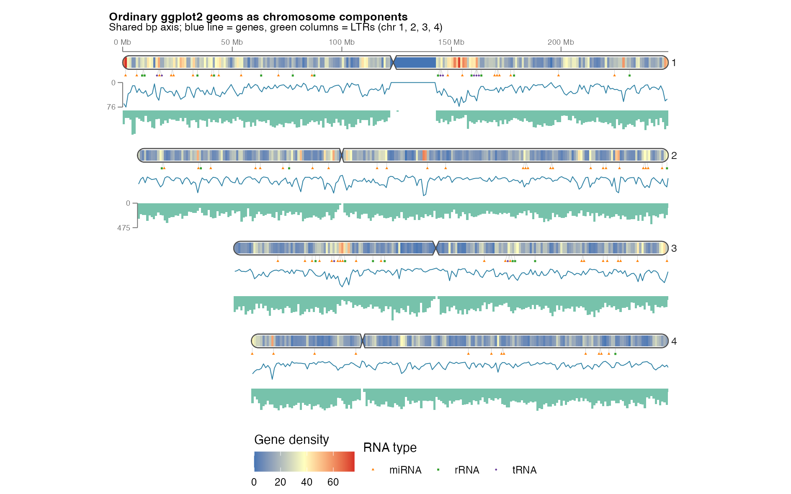

# ggideogram

[](https://github.com/zbh200937/ggideogram/actions/workflows/R-CMD-check.yaml)
[](LICENSE)
[](https://www.r-project.org/)

[中文](#中文) · [English](#english)

> [!IMPORTANT]
> **致谢 / Acknowledgement:** `ggideogram` would not exist without
> [RIdeogram](https://github.com/TickingClock1992/RIdeogram). We are deeply
> grateful to Zhaodong Hao, Dekang Lv, Ying Ge, Jisen Shi, Dolf Weijers,
> Guangchuang Yu, and Jinhui Chen for the original chromosome-ideogram design,
> implementation, and example datasets. This repository is an independent
> ggplot2-first refactor, not an official successor to RIdeogram.



## 中文

### 项目定位

`ggideogram` 是染色体坐标域上的 ggplot2 扩展。它把染色体表达为可组合的数据布局、
坐标变换、图层和 guide，而不是先绘制一张固定画布再整体缩放。

因此，染色体可以：

- 作为完整的 ggplot 图形与 patchwork、cowplot 和 `ggsave()` 配合；
- 作为普通柱状图、箱线图和折线图的原生 x/y 轴；
- 接收点、折线、柱、面积、ribbon、tile、文字、箱线和小提琴等 bp 对齐轨道；
- 接收带有独立坐标轴、主题和图例的完整 ggplot/grob inset；
- 作为标准 ggplot/grob 组件嵌入其他图形。

### 主要特性

- `scale_x_chromosome()` 和 `scale_y_chromosome()`：染色体直接成为普通 ggplot 的
  离散轴，宿主 `geom_col()`、`geom_boxplot()` 等保持原样。
- `ggideogram()`：生成标准 ggplot 对象，无 A4 画布、像素换算或第二套渲染器。
- `geom_chr_marker()`：使用真正的 `GeomPoint`，支持标准 `shape`、`size`、`fill`、
  `colour`、`alpha`、scale 和 guide。
- `track()` / `track_layout()`：提前声明轨道空间和数值范围，所有轨道与染色体长轴
  共享同一个 bp 投影。
- `geom_track_tile(clip = "auto")`：染色体内部热图自动按圆帽和着丝粒轮廓裁切，
  同时保留 `GeomTile` 的 fill scale 和图例语义。
- 文字、点、线宽和图例键使用 ggplot2/grid 的物理尺寸；改变组合槽大小不会把它们
  当作整张图片压缩。

### 安装

从 GitHub 安装当前版本：

```r
install.packages("remotes")
remotes::install_github("zbh200937/ggideogram")
```

也可以使用 `pak`：

```r
pak::pak("zbh200937/ggideogram")
```

要求 R >= 4.1.0、ggplot2 >= 3.5.0。

### 最小示例

```r
library(ggideogram)
library(ggplot2)

data("human_karyotype", package = "ggideogram")

p <- ggideogram(
  human_karyotype,
  ncol = 12,
  axis = c("1", "13"),
  axis_side = "left"
)

p +
  labs(title = "Human chromosomes") +
  theme(plot.title = element_text(face = "bold"))
```

轴数字的位置由刻度物理长度、字号和 `axis_label_gap` 自动推导，不需要针对设备尺寸
写死坐标偏移。

### 染色体作为普通 ggplot 的原生轴

```r
data("Random_RNAs_500", package = "ggideogram")

chromosome_order <- human_karyotype$Chr
rna_counts <- as.data.frame(table(factor(
  Random_RNAs_500$Chr,
  levels = chromosome_order
)))
names(rna_counts) <- c("Chr", "Records")

ggplot(rna_counts, aes(Chr, Records)) +
  geom_col(fill = "#2C7FB8") +
  scale_x_chromosome(human_karyotype) +
  labs(x = "Chromosome", y = "RNA records")
```

这里没有拼接第二个 ideogram 面板；染色体由离散 scale 的 guide 绘制，并按原始
`Chr` break 与柱子对齐。

### bp 对齐轨道

```r
data("gene_density", package = "ggideogram")
data("LTR_density", package = "ggideogram")

gene_density$Position <- (gene_density$Start + gene_density$End) / 2
LTR_density$Position <- (LTR_density$Start + LTR_density$End) / 2

tracks <- track_layout(
  genes = track("right", width = 1.2,
                limits = range(gene_density$Value)),
  ltr = track("right", width = 1.2,
              limits = range(LTR_density$Value))
)

ggideogram(
  human_karyotype,
  ncol = 12,
  tracks = tracks,
  axis = c("1", "13")
) +
  geom_track_line(
    data = gene_density,
    aes(chr = Chr, position = Position, value = Value, group = Chr),
    track = "genes",
    colour = "#277DA1"
  ) +
  geom_track_col(
    data = LTR_density,
    aes(chr = Chr, position = Position, value = Value,
        width = End - Start),
    track = "ltr",
    position = "identity",
    fill = "#43AA8B"
  )
```

常用轨道封装包括：

```text
geom_track_point()    geom_track_line()     geom_track_col()
geom_track_area()     geom_track_ribbon()   geom_track_tile()
geom_track_text()     geom_track_boxplot()  geom_track_violin()
```

第三方 geom 可通过 `geom_chr_track(geom = your_geom, ...)` 接入。完整子图使用
`geom_chr_inset()`；它会在自己的 viewport 中重新构建，不先栅格化再缩放。

### 原版数据功能画廊

以下结果只使用包内继承自 RIdeogram 的数据，保留原始 bp 坐标和观测值：

| 能力 | PNG | PDF |
| --- | --- | --- |
| 原版语义的 ggplot2 重构 | [查看](inst/examples/gallery-classic-rebuilt.png) | [矢量版](inst/examples/gallery-classic-rebuilt.pdf) |
| 折线、柱、热图和 marker 的 bp 对齐轨道 | [查看](inst/examples/gallery-inward-tracks.png) | [矢量版](inst/examples/gallery-inward-tracks.pdf) |
| 完整 ggplot 与 ideogram 双向 inset | [查看](inst/examples/gallery-bidirectional-insets.png) | [矢量版](inst/examples/gallery-bidirectional-insets.pdf) |
| ideogram 与柱状图、箱线图向外拼接 | [查看](inst/examples/original-data-composition.png) | [矢量版](inst/examples/original-data-composition.pdf) |
| 染色体作为柱状图 x 轴 | [查看](inst/examples/original-data-chromosome-x-axis.png) | [矢量版](inst/examples/original-data-chromosome-x-axis.pdf) |
| 染色体作为箱线图 y 轴 | [查看](inst/examples/original-data-chromosome-y-axis.png) | [矢量版](inst/examples/original-data-chromosome-y-axis.pdf) |

运行 [inst/examples/original-data-gallery.R](inst/examples/original-data-gallery.R)
可以一次重生成全部六图。项目的规范性设计见
[ARCHITECTURE.md](ARCHITECTURE.md)。

### 致谢、来源与引用

本项目建立在 RIdeogram 的原创工作之上。尤其感谢 RIdeogram 作者提供：

- 染色体 ideogram 的核心几何与表现思路；
- 本包用于兼容性验证和示例的 karyotype、gene-density、LTR-density 与 RNA 数据；
- 面向全基因组数据可视化的原始 API 和使用范式。

RIdeogram 论文：

> Hao Z, Lv D, Ge Y, Shi J, Weijers D, Yu G, Chen J. (2020).
> RIdeogram: drawing SVG graphics to visualize and map genome-wide data on
> the idiograms. *PeerJ Computer Science*, 6:e251.
> https://doi.org/10.7717/peerj-cs.251

使用本包或继承数据时，请同时引用 `ggideogram` 和上述 RIdeogram 论文。完整来源说明
见 [ACKNOWLEDGEMENTS.md](ACKNOWLEDGEMENTS.md)，R 中可运行
`citation("ggideogram")` 查看引用信息。

### 许可与贡献

项目使用 [Artistic License 2.0](LICENSE) 开源。问题报告和贡献说明见
[CONTRIBUTING.md](CONTRIBUTING.md)。

---

## English

### What is ggideogram?

`ggideogram` extends ggplot2 with a chromosome coordinate domain. Chromosomes
are represented as composable layouts, coordinate transforms, layers, and
guides—not as a pre-rendered page that must be scaled as one image.

Chromosomes can therefore:

- behave as ordinary ggplot objects in patchwork, cowplot, and `ggsave()`;
- serve as native x or y axes for standard bar, box, and line plots;
- host bp-aligned point, line, column, area, ribbon, tile, text, boxplot, and
  violin tracks;
- host complete ggplot/grid insets with independent axes, themes, and guides;
- be embedded as standard ggplot or grob components in other figures.

### Highlights

- `scale_x_chromosome()` and `scale_y_chromosome()` draw chromosomes in an
  ordinary discrete-axis guide without rewriting the host geom.
- `ggideogram()` returns a standard ggplot object with no fixed page, pixel
  conversion, or compatibility renderer.
- `geom_chr_marker()` is backed by `GeomPoint`, so standard shape, size, fill,
  colour, alpha, scales, and guides work naturally.
- `track()` and `track_layout()` declare track space and value ranges before
  drawing; every track shares the chromosome's bp projection.
- `geom_track_tile(clip = "auto")` clips an internal heatmap to rounded caps
  and the centromere silhouette while retaining `GeomTile` scale/guide
  semantics.
- Text, points, strokes, and legend keys use physical ggplot2/grid sizes and
  are not compressed when a composite slot changes size.

### Installation

Install the current release from GitHub:

```r
install.packages("remotes")
remotes::install_github("zbh200937/ggideogram")
```

Or with `pak`:

```r
pak::pak("zbh200937/ggideogram")
```

Requires R >= 4.1.0 and ggplot2 >= 3.5.0.

### Minimal example

```r
library(ggideogram)
library(ggplot2)

data("human_karyotype", package = "ggideogram")

p <- ggideogram(
  human_karyotype,
  ncol = 12,
  axis = c("1", "13"),
  axis_side = "left"
)

p +
  labs(title = "Human chromosomes") +
  theme(plot.title = element_text(face = "bold"))
```

Axis labels are positioned from the physical tick length, font size, and
`axis_label_gap`; no device-specific coordinate offsets are required.

### Chromosomes as native ggplot axes

```r
data("Random_RNAs_500", package = "ggideogram")

chromosome_order <- human_karyotype$Chr
rna_counts <- as.data.frame(table(factor(
  Random_RNAs_500$Chr,
  levels = chromosome_order
)))
names(rna_counts) <- c("Chr", "Records")

ggplot(rna_counts, aes(Chr, Records)) +
  geom_col(fill = "#2C7FB8") +
  scale_x_chromosome(human_karyotype) +
  labs(x = "Chromosome", y = "RNA records")
```

This is one ordinary data panel—not an ideogram panel placed beside a bar
plot. The chromosome guide aligns each body to the raw `Chr` break.

### BP-aligned tracks

```r
data("gene_density", package = "ggideogram")
data("LTR_density", package = "ggideogram")

gene_density$Position <- (gene_density$Start + gene_density$End) / 2
LTR_density$Position <- (LTR_density$Start + LTR_density$End) / 2

tracks <- track_layout(
  genes = track("right", width = 1.2,
                limits = range(gene_density$Value)),
  ltr = track("right", width = 1.2,
              limits = range(LTR_density$Value))
)

ggideogram(
  human_karyotype,
  ncol = 12,
  tracks = tracks,
  axis = c("1", "13")
) +
  geom_track_line(
    data = gene_density,
    aes(chr = Chr, position = Position, value = Value, group = Chr),
    track = "genes",
    colour = "#277DA1"
  ) +
  geom_track_col(
    data = LTR_density,
    aes(chr = Chr, position = Position, value = Value,
        width = End - Start),
    track = "ltr",
    position = "identity",
    fill = "#43AA8B"
  )
```

Convenience wrappers include:

```text
geom_track_point()    geom_track_line()     geom_track_col()
geom_track_area()     geom_track_ribbon()   geom_track_tile()
geom_track_text()     geom_track_boxplot()  geom_track_violin()
```

Compatible third-party geoms can enter through
`geom_chr_track(geom = your_geom, ...)`. Use `geom_chr_inset()` for complete
plots; child plots are rebuilt inside their own viewports rather than
rasterized and scaled.

### Gallery using the original bundled data

All six figures preserve the original bp coordinates and observations inherited
from RIdeogram:

| Capability | PNG | PDF |
| --- | --- | --- |
| RIdeogram semantics rebuilt through ggplot2 | [View](inst/examples/gallery-classic-rebuilt.png) | [Vector](inst/examples/gallery-classic-rebuilt.pdf) |
| BP-aligned line, column, heatmap, and marker tracks | [View](inst/examples/gallery-inward-tracks.png) | [Vector](inst/examples/gallery-inward-tracks.pdf) |
| Complete ggplot/ideogram insets in both directions | [View](inst/examples/gallery-bidirectional-insets.png) | [Vector](inst/examples/gallery-bidirectional-insets.pdf) |
| Outward composition with a bar plot and boxplot | [View](inst/examples/original-data-composition.png) | [Vector](inst/examples/original-data-composition.pdf) |
| Chromosomes as a bar chart's x axis | [View](inst/examples/original-data-chromosome-x-axis.png) | [Vector](inst/examples/original-data-chromosome-x-axis.pdf) |
| Chromosomes as a boxplot's y axis | [View](inst/examples/original-data-chromosome-y-axis.png) | [Vector](inst/examples/original-data-chromosome-y-axis.pdf) |

Run [inst/examples/original-data-gallery.R](inst/examples/original-data-gallery.R)
to regenerate the complete gallery. The normative architecture is documented
in [ARCHITECTURE.md](ARCHITECTURE.md).

### Acknowledgements, provenance, and citation

This project is built on the original work of RIdeogram. We especially thank
the RIdeogram authors for:

- the chromosome-ideogram geometry and visual model;
- the karyotype, gene-density, LTR-density, and RNA datasets used here for
  compatibility checks and examples;
- the original API and workflows for genome-wide visualization.

Please cite the original paper:

> Hao Z, Lv D, Ge Y, Shi J, Weijers D, Yu G, Chen J. (2020).
> RIdeogram: drawing SVG graphics to visualize and map genome-wide data on
> the idiograms. *PeerJ Computer Science*, 6:e251.
> https://doi.org/10.7717/peerj-cs.251

When using this package or its inherited datasets, please cite both
`ggideogram` and the RIdeogram paper. See
[ACKNOWLEDGEMENTS.md](ACKNOWLEDGEMENTS.md) for the complete provenance note,
or run `citation("ggideogram")` after installation.

### License and contributing

Released under the [Artistic License 2.0](LICENSE). Bug reports and pull
requests are welcome; see [CONTRIBUTING.md](CONTRIBUTING.md).
