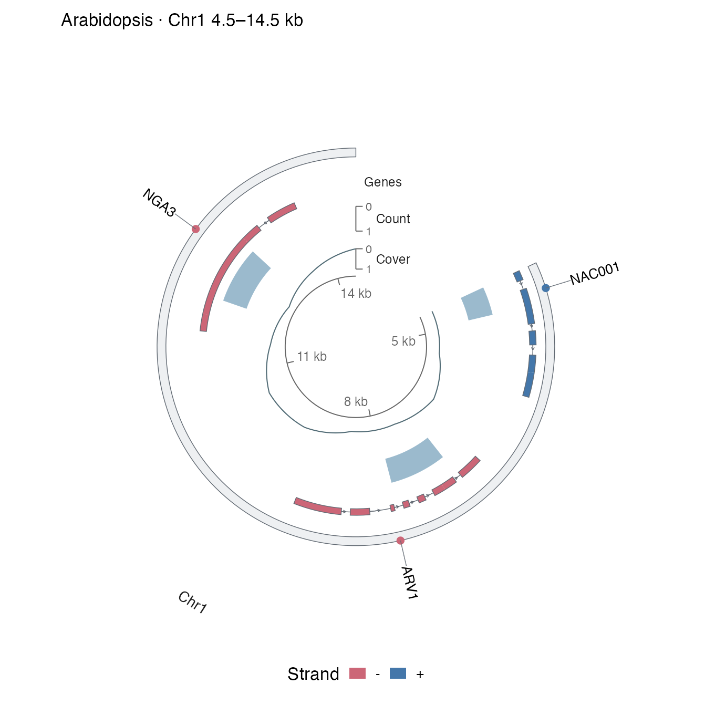

# ggideogram

[](https://github.com/zbh200937/ggideogram/actions/workflows/R-CMD-check.yaml)
[](LICENSE)

**用 ggplot2 绘制染色体、基因结构、多轨道与基因组连接。**

`ggideogram()` 返回标准 **ggplot 对象**。染色体与轨道共享原始 bp 坐标；颜色、点、线、文字和图例沿用 ggplot2。你可以加入普通 geom，定位完整 ggplot/grob 子图，也可以将 ideogram 交给 patchwork 或 cowplot 组合。



[快速开始](#快速开始) · [公共函数](#公共函数) · [示例画廊](#示例画廊) · [English overview](#english-overview)

## 安装

需要 R ≥ 4.1、ggplot2 ≥ 3.5。以下安装块同时安装本文组合示例使用的 patchwork。

```r
install.packages(c("remotes", "patchwork"))
remotes::install_github("zbh200937/ggideogram")
```

克隆仓库后也可在源码目录运行 `R CMD INSTALL .`。自由避让标签需要 ggrepel；交互图需要 ggiraph 和 htmlwidgets；GRanges 输入需要 GenomicRanges。

## 快速开始

以下 R 代码块按顺序运行即可。数据均随包提供，不需要另外下载。

```r
library(ggideogram)
library(ggplot2)

data(human_karyotype, package = "ggideogram")
data(gene_density, package = "ggideogram")

# 闭区间对应的绘图边界为 Start - 1 和 End。
density <- transform(gene_density, Mid = (Start - 1 + End) / 2)

p <- ggideogram(human_karyotype, chr = c("1", "2"),
  orientation = "horizontal", axis = TRUE) +
  geom_track(track = "density", side = "right", width = 3,
    data = density, mapping = aes(chr = Chr, x = Mid, y = Value),
    label = "Genes / window", axis = list(breaks = c(0, 50)),
    layers = list(
      geom_line(colour = "#4477AA", linewidth = 0.4),
      geom_point(colour = "#4477AA", size = 0.7)
    )) +
  labs(title = "Human gene density") +
  theme(plot.margin = margin(5, 12, 5, 30, unit = "mm"))
p
```

轨道映射中，**`x` 始终是原始 bp，`y` 始终是原始观测值**，与显示方向无关。同一命名轨道里的图层共享空间与值域；图层自己的数据、映射和样式可以分别设置。

### 水平、垂直和环形

同一组数据与轨道可用于三种方向。`reverse_chr` 只改变指定染色体的显示方向。

```r
tracks <- list(
  density = geom_track(side = "right", width = 3,
    data = density, mapping = aes(chr = Chr, x = Mid, y = Value),
    geom = geom_line(colour = "#4477AA", linewidth = 0.4))
)

p_vertical <- ggideogram(human_karyotype, chr = c("1", "2"),
  orientation = "vertical", tracks = tracks)
p_horizontal <- ggideogram(human_karyotype, chr = c("1", "2"),
  orientation = "horizontal", reverse_chr = "2", tracks = tracks)
p_circular <- ggideogram(human_karyotype,
  orientation = "circular", opening_angle = 25, tracks = tracks)
p_circular
```

`side = "left"` 对应竖排左侧、横排上侧和环形内侧；`"right"` 对应另一侧。环形也可直接使用 `"inner"` / `"outer"`，主体内轨道使用 `"overlay"`。`width` 与 `gap` 以染色体主体宽度为单位；原生 geom 的点大小、字号和线宽保持 ggplot2 的物理尺寸语义。

### 调整轨道

使用同一 `track` 名称即可更新已有轨道。省略的参数保持原值；新内容默认追加，`replace = TRUE` 替换内容。

例如 `p + geom_track(track = "density", width = 4, gap = 0.5)` 调整空间，`label = list(size = 2.8)` 调整标题字号，`axis = list(n = 2)` 调整数值刻度数量。

`limits`、`value_scale`、`transform` 和 `reverse` 控制轨道数值尺度；`label = NULL` 移除标题，`axis = FALSE` 关闭数值轴。原生 point、line、col、area、ribbon、tile、text、boxplot 和 violin 可通过 `geom` 或 `layers` 接入。箱线与小提琴的统计在原始值上计算，宽度参数使用 bp。兼容的第三方 identity geom 也可使用这一入口，具体示例见[交互轨道脚本](inst/examples/interactive-gallery.R)。

## 局部视图与基因结构

下面使用包内拟南芥 TAIR10 / Araport11 注释，按 GFF3 的 Parent 关系连接转录本和基因，再绘制 Chr1 的局部结构。

```r
features <- read_chr_features(system.file("extdata",
  "arabidopsis-first-genes.gff3", package = "ggideogram"))
tx <- features[features$Type == "mRNA", ]
features$Transcript <- ifelse(features$Type == "mRNA",
  features$ID, features$Parent)
models <- features[features$Transcript %in% tx$ID, ]
models$Gene <- sub("gene:", "",
  tx$Parent[match(models$Transcript, tx$ID)])

arabidopsis <- data.frame(Chr = c("1", "5"), Start = 0,
  End = c(30427671, 26975502))
view <- chr_view(arabidopsis, chr = "1", start = 2500, end = 15000)

p_genes <- ggideogram(view, orientation = "horizontal", axis = TRUE) +
  geom_track(track = "genes", side = "right", width = 5,
    data = models,
    mapping = aes(chr = Chr, start = Start, end = End,
      gene = Gene, type = Type, strand = Strand, fill = Strand),
    layers = list(geom_genemodel(mode = "gene", label_size = 2.8))) +
  scale_fill_manual(values = c("+" = "#4477AA", "-" = "#CC6677")) +
  theme(plot.margin = margin(5, 5, 5, 25, unit = "mm"))
p_genes
```

外显子以轮廓表达完整区间，CDS 和显式 UTR 使用填充；内含子箭头表示链方向。`mode = "gene"` 表达基因内同类区间的并集，`mode = "transcript"` 配合 `transcript` 映射逐条绘制转录本。完整源注释可用于局部轨道，结构按显示窗口裁切，刻度保留原始 bp。

`read_karyotype()` 读取 chrom.sizes / FAI；`read_chr_features()` 读取 BED / GFF3 / GTF，`as_chr_features()` 接入数据框或 GRanges。**BED 由读取函数转换为 1-based closed；GFF3、GTF 和 GRanges 保留其注释坐标。** 染色体名称和组装版本应与核型一致。

需要窗口汇总时，`bin_genome()` 提供区间中点计数（`count`）、区间并集覆盖率（`coverage`）和按重叠长度加权的均值（`weighted_mean`）；统计结果可直接映射到数值轨道。

## 位点标注与双端连接

`geom_locus()` 接入点、文字、区间和引导线。文字可选择 `position = "identity"`、`"spread"` 或 `"repel"`。有序展开按实际文字尺寸安排位置，引导线仍连接真实位点；`track` 和 `track_position` 可把标注放在已声明轨道的近端、中线或远端。完整代码见[位点与标签示例](inst/examples/label-layout-gallery.R)。

下面绘制 MCScanX 官方拟南芥示例中的 Chr1–Chr5 共线性区块。

```r
blocks <- read.delim(system.file("extdata",
  "arabidopsis-synteny-blocks.tsv", package = "ggideogram"))
blocks <- blocks[blocks$Chr1 != blocks$Chr2, ]

p_links <- ggideogram(arabidopsis, orientation = "circular") +
  geom_chrlink(type = "interval", data = blocks,
    mapping = aes(chr1 = Chr1, start1 = Start1, end1 = End1,
      chr2 = Chr2, start2 = Start2, end2 = End2,
      orientation = Orientation, fill = Orientation),
    alpha = 0.4, colour = NA) +
  scale_fill_manual(values = c("+" = "#4477AA", "-" = "#CC6677"),
    name = "Block order")
p_links
```

`type = "point"` 连接两个位点；`type = "interval"` 保留两端区间宽度。也可用 `chr_nodes()` 建立唯一 ID 节点表，再通过 `aes(from, to)` 连接。多基因组数据使用 `chr_key()` 区分基因组、染色体与组装版本，见[多基因组示例](inst/examples/multi-genome-gallery.R)。

## 完整子图与外部组合

完整子图保留自己的坐标、主题和图例；`geom_locus_inset()` 只将其锚点定位到主图 bp。

```r
child <- ggplot(subset(density, Chr == "1"), aes(Value)) +
  geom_histogram(bins = 15, fill = "#4477AA", colour = "white") +
  labs(x = "Genes / window", y = "Windows") +
  theme_minimal(base_size = 8)

p_inset <- ggideogram(human_karyotype, chr = "1",
  orientation = "horizontal",
  tracks = list(summary = geom_track(side = "right", width = 14))) +
  geom_locus_inset(plot = child,
    data = data.frame(Chr = "1", Pos = 1.2e8),
    mapping = aes(chr = Chr, position = Pos), track = "summary",
    width = grid::unit(40, "mm"), height = grid::unit(30, "mm"))
p_inset

# ideogram 作为并列面板，或嵌入另一张图。
p_combined <- patchwork::wrap_plots(p, child, widths = c(2, 1))
p_embedded <- child + patchwork::inset_element(p_circular,
  left = 0.5, bottom = 0.5, right = 1, top = 1)
p_combined

ggsave("ideogram-combined.pdf", p_combined,
  width = 180, height = 100, units = "mm")
```

染色体也可直接作为普通 ggplot 的离散 x/y 轴，按染色体键与原生图层对齐。

```r
p_axis <- ggplot(subset(gene_density, Chr %in% c("1", "2", "3")),
  aes(Chr, Value)) +
  geom_boxplot(fill = "#AACCEE") +
  scale_x_chromosome(human_karyotype) +
  labs(x = NULL, y = "Genes / window") +
  theme_minimal()
p_axis
```

## 公共函数

| 用途 | 入口 |
| --- | --- |
| 建图与染色体主体、名称、刻度、条带、内部填充 | `ggideogram()`、`geom_chr(component = ...)` |
| 声明或调整轨道，接入原生图层 | `geom_track()`、`track_layout()` |
| 基因与转录本结构 | `geom_genemodel(mode = ...)` |
| 位点点标记、文字、区间与引导线 | `geom_locus(geom = ...)` |
| 节点表与双端关系 | `chr_nodes()`、`geom_chrlink(type = ...)` |
| 定位完整子图、提取标准 grob | `geom_locus_inset()`、`as_ideogram_grob()` |
| 染色体作为普通图的轴 | `scale_x_chromosome()`、`scale_y_chromosome()` |
| 数据读取、局部窗口、窗口汇总 | `read_karyotype()`、`read_chr_features()`、`chr_view()`、`view_chr_data()`、`bin_genome()` |
| 扩展包的数据投影 | `project_chr_point()`、`project_chr_interval()`、`project_chr_track()` |
| 交互查看与源记录选择、导出 | `as_ideogram_widget()` |

详细参数及示例见各函数的 R 帮助页，例如 `?geom_track`。主图样式继续使用 `theme()`、`scale_*()` 和 `guides()`。

## 示例画廊

| 内容 | 可运行脚本 / 已有图形 |
| --- | --- |
| 局部环形、同轨多层、基因结构与 ID 连接 | [脚本](inst/examples/optimized-gallery.R) · [PNG](inst/examples/optimized-local-circle.png) · [PDF](inst/examples/optimized-local-circle.pdf) |
| ideogram 与普通柱状图、箱线图组合 | [脚本](inst/examples/original-data-composition.R) · [PNG](inst/examples/original-data-composition.png) |
| 完整子图向内接入、ideogram 向外嵌入 | [脚本](inst/examples/original-data-gallery.R) · [PNG](inst/examples/gallery-bidirectional-insets.png) |
| 原生染色体 x/y 轴 | [脚本](inst/examples/original-data-axis-integration.R) · [x 轴图](inst/examples/original-data-chromosome-x-axis.png) · [y 轴图](inst/examples/original-data-chromosome-y-axis.png) |
| 局部窗口与基因、转录本结构 | [局部视图](inst/examples/local-view-gallery.R) · [基因结构](inst/examples/gene-structure-gallery.R) |
| 内部填充、密集标签、共线性与多基因组 | [内部注释](inst/examples/internal-annotation-gallery.R) · [标签](inst/examples/label-layout-gallery.R) · [连接](inst/examples/connection-gallery.R) · [多基因组](inst/examples/multi-genome-gallery.R) |
| 全基因组环形与交互 | [环形](inst/examples/circular-gallery.R) · [交互](inst/examples/interactive-gallery.R) |

各脚本开头列出运行方法，相关数据随包提供于 [inst/extdata](inst/extdata)。数据来源与准备方法见脚本注释及该目录中的来源说明。

## 致谢与许可证

本项目的染色体几何与部分示例数据源自 [RIdeogram](https://github.com/TickingClock1992/RIdeogram)。感谢原作者 Zhaodong Hao、Dekang Lv、Ying Ge、Jisen Shi、Dolf Weijers、Guangchuang Yu 和 Jinhui Chen。原论文：Hao et al. (2020), *RIdeogram: drawing SVG graphics to visualize and map genome-wide data on the idiograms*, [PeerJ Computer Science 6:e251](https://doi.org/10.7717/peerj-cs.251)。

`ggideogram` 是独立的 ggplot2 扩展，重构了数据模型、布局、原生图层与组合接口，采用 [Artistic License 2.0](LICENSE)。包内其他来源的数据附有来源记录，MCScanX 材料的许可证见 [MCScanX-LICENSE.txt](inst/extdata/MCScanX-LICENSE.txt)。

## English overview

**ggideogram extends ggplot2 to chromosome coordinates.** It returns an ordinary ggplot with shared genomic bp coordinates for chromosome bodies, gene models, quantitative tracks, locus annotations and links.

Use `geom_track()` to add native ggplot2 layers: **x is source bp and y is the raw track value**, whether the layout is vertical, horizontal or circular. Track settings control space and value ranges; native layers retain their styling and guides. `geom_genemodel()` shows exon outlines, CDS/UTR fills and intron direction. `geom_locus()` adds points and labels, and `geom_chrlink()` connects loci or intervals.

`geom_locus_inset()` anchors a complete ggplot/grob with its own coordinates. Ideograms also work as patchwork/cowplot panels or insets. `scale_x_chromosome()` and `scale_y_chromosome()` provide chromosome axes for ordinary charts. Readers support chromosome sizes/FAI, BED, GFF3/GTF and optional GRanges input; local views preserve source coordinates. Compatible ggiraph layers provide optional interactive viewing.

Install from GitHub with the installation block above, then run the examples from top to bottom. They use bundled human and Arabidopsis data. R ≥ 4.1 and ggplot2 ≥ 3.5 are required. This independent refactor derives chromosome geometry and example data from **RIdeogram by Hao et al.** and is distributed under **Artistic-2.0**.
